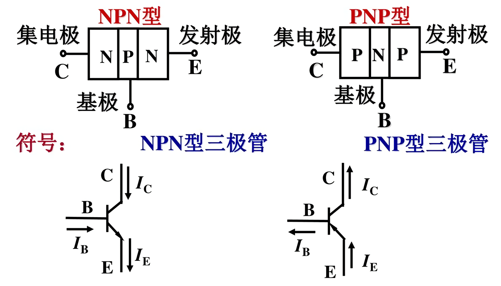
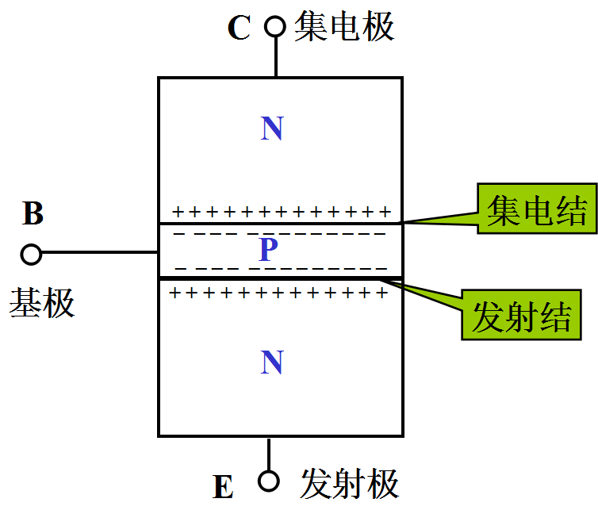
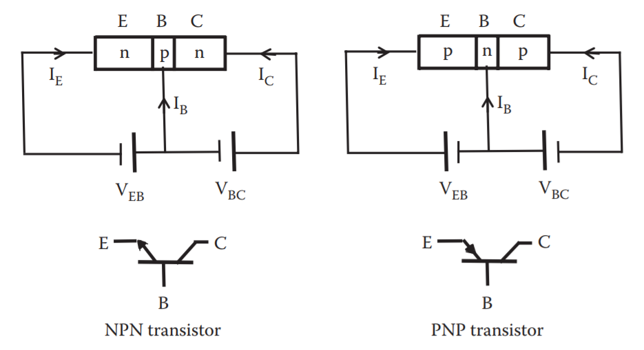

Bipolar Junction Transistor (三极管)

> A `bipolar junction transistor` (`bipolar transistor` or `BJT`) is a type of transistor that uses both electron and hole charge carriers.

> BJTs use two junctions between two semiconductor types, n-type and p-type.

___

#### 0. 为什么学这个？

因为放大器电路需要它。

Transistor (晶体管)

> A semiconductor device with three connections, capable of amplification in addition to rectification.

___

#### 1. 认识你自己（不对，应该是认识一下三极管）

`E` means `emitter`

`B` means `base`

`C` means `collector`

___

#### 2. 了解更多

箭头所指方向为电流流动的方向。

学到 PN结 的都知道，电流从正电压出发，由 P 流到 N

____

#### 3. 总结规律

$$
\begin{align*}
&I_E = I_C + I_B
\\ \\
&I_C  \approx I_E = A \cdot I_B (A > 0)
\\ \\
&\text{# A 是一个系数，反正整个式子表示 } I_C \text{ 是 } I_B \text{ 的 A 倍}
\end{align*}
$$

所以才把`E端`叫做`发射区`啊， 因为三级管在起放大作用时，`E端`输出的电流是最大的。

** 靠近中间那块板子的箭头 所在的部分是 E(发射区)，它的对面是 C(集电区)，中间永远为 B(基区)**

___

#### 4. 升仙（不对，升华）

在讲这个之前，我要先讲讲什么叫做`正偏`、什么叫做`反偏`（当然，都是一个名字、代号而已）

正偏：$$U_p > U_n$$

反偏：$$U_p < U_n$$

比如：

正偏就是指`PN结`中的`P端`电压大于`N端`，也就是正向导通

反偏就是指`PN结`中的`P端`电压小于`N端`，也就是反向导通了。

___

于是乎，在三级管起放大作用时(他们称它正处在`整个元件输出函数图`的`放大区`)

此时：`EB结(发射结)`正偏；`CB结(集电结)`反偏

___

饱和区：`EB结(发射结)`正偏；`CB结(集电结)`正偏

截止区：`EB结(发射结)`反偏；`CB结(集电结)`反偏

___

#### 5. 记忆秘诀

带箭头的是B(射极)

B的对面是C(集极)

中间那个自然就是B(基极)
