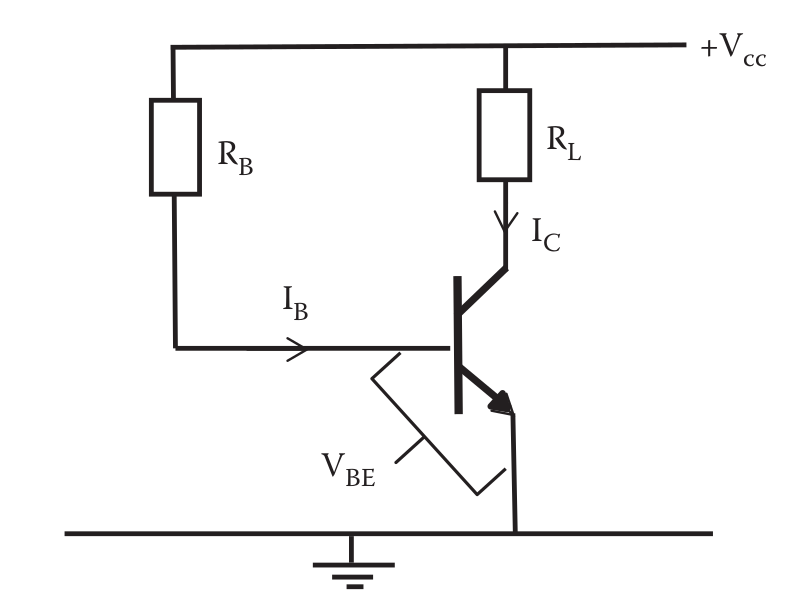

# Biasing

## 1. Introduction

Biasing in electronics means establishing predetermined voltages or currents at various points of an electronic circuit for the purpose of establishing proper operating conditions in electronic components.

这个时候你可能会想到叠加定理，是的，没错，只是我以前忘了做查询。这东西就是做叠加定理时会用到的手段。只不过这里要把概念扩大一下。

Many electronic devices such as transistors and vacuum tubes, whose function is processing time-varying \(AC\) signals also require a steady \(DC\) current or voltage to operate correctly — a bias.

这里讲的是。。。有些元件，比如三极管，既需要一个稳定的`直流电`给它把电路导通，又需要一点点`交流电`让它完成工作\(比如把小信号放大：小交流电流控制大直流电流，最终输出大交流电流\)

The AC signal applied to them is superposed\(叠加\) on this DC bias current or voltage. The operating point of a device, also known as bias point, quiescent\(静态\) point, or Q-point, is the steady-state \(DC\) voltage or current at a specified terminal of an active device \(a transistor or vacuum tube\) with no input signal applied. A bias circuit is a portion of the device's circuit which supplies this steady current or voltage.

然后它又说了，给`只分析直流时的电路状态`取一个名字，叫做`静态工作点`。这时的电路可以由原电路变化而来，具体做法我等会儿再讲。

## 2. How to bias a `Bipolar Junction Transistor (三极管)`

1. 电流从 $$V_{cc}$$ 开始，到`地`为止
2. 遇到电容断路，后面的就不要了

实在不行问你老师，你可是交过钱的

## 3. What we will get from this operation?

如果最后成功了，你会得到这个：

$$V_{CC} = I_B R_B + V_{BE}$$

$$V_{CC} = I_C R_L + V_{CE}$$

总之你给我记住：

**放大电路既要有直流、又要有交流**

**直流导通三极管，为交流以及整个电流提供一条固定的路经，然后电子才可以在里面跑，然后 magic thing 才可以发生**

提示：

$$I_B$$ 指基极上的整个电流

$$I_C$$ 指集极上的整个电流

$$I_E$$ 指射极上的整个电流

$$R_e$$ 指射极上的所有电阻之合，以此类推

$$V_{CE}$$ 指的是三极管上从C\(collector\)到E\(emitter\)的电压差；我中文老师是用的$$U_{CE}$$，不明所以

