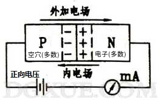

# PN junction

* 基本原理： 物质总是从“高”到“低”流动
* `PN结`的组成：一半`P型半导体`和一半`N型半导体`拼成的整体
* `PN结`产生了什么？

  > 1. `P型半导体`空穴多，`N型半导体`电子多，物质由“高”向“低”流动
  > 2. P 的空穴跑到了 N，正电粒子跑到了 N， P 变为负极
  > 3. N 的电子跑到了 P，负电粒子跑到了 P， N 变为正极
  >
  >    
  >
  > 4. 中间那条线为正负交界，达到稳定状态，形成`PN结`，该“结”产生的电场所占有的能量被叫做`电动势能`，也被叫做`壁垒高度`
  > 5. 硅的`壁垒高度`为0.5V左右，锗的`势垒高度`为0.1V左右；其高度随温度的升高而下降

* `PN结`的特性

  $$
  \begin{align*}
  U_P &> U_N \text{ (电压P > 电压N)}
  \\ \\
  &\Downarrow
  \\ \\
  &\text{PN结正向偏置（正偏）}
  \\ \\
  &\Downarrow
  \\ \\
  &\text{当 } (U_P - U_N > 0.5\text{(硅)}) \text{ } or \text{ } (U_P - U_N > 0.1\text{(锗)})
  \\ \\
  &PN结被导通
  \\ \\
  &\text{当 } (U_P - U_N) \text{ 达不到 0.5 或 0.1}
  \\ \\
  &正常情况, 未被导通
  \\ \\ \\
  \end{align*}
  $$

$$
\begin{align*}
&U_P < U_N \text{, 反向偏置}
\\ \\
&\text{此时PN结处于截止状态，电流很小, 可以当成开路}
\end{align*}
$$

