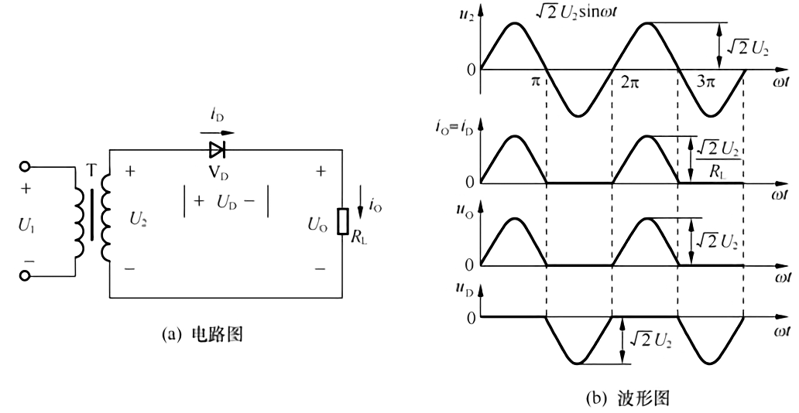
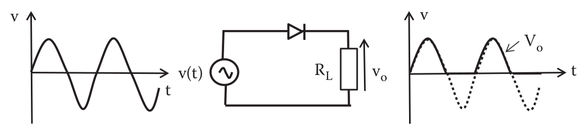
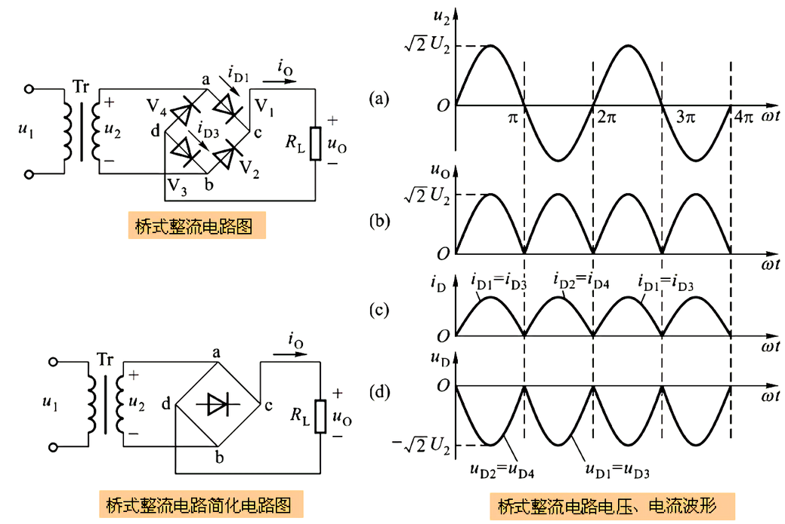
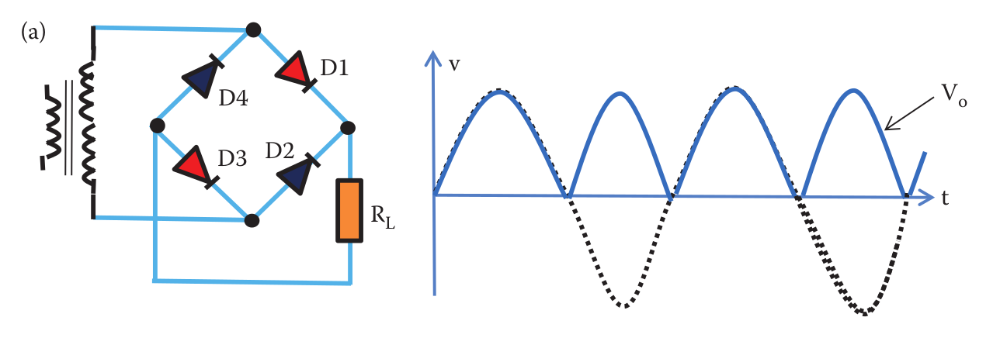
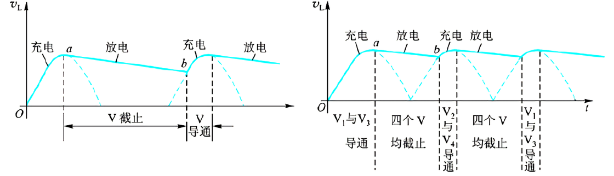
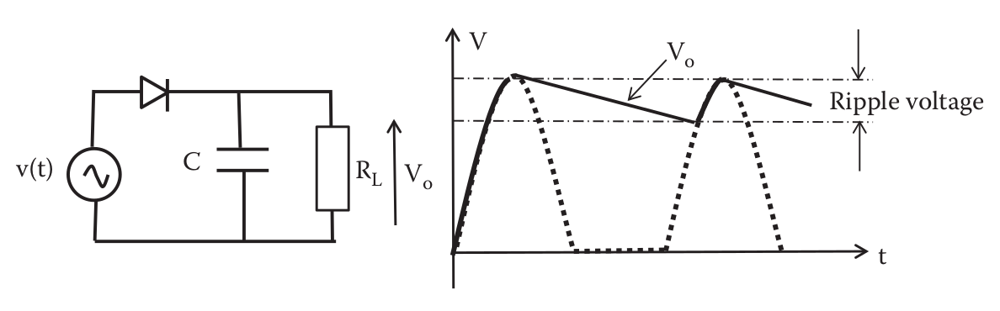
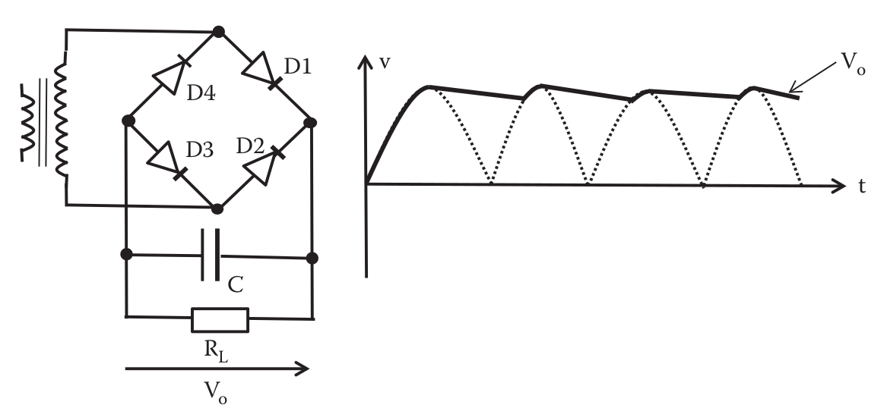

# Rectifier circuit

> an electrical device that converts an alternating current into a direct one by allowing a current to flow through it in one direction only.

## 半波整流把交流电中的负电流抛弃，只剩正电流

 

When I look at this picture, all I thinking is: wow, my teacher got wrong.

我老师说`diode`元件符号是`V`, that was definitely wrong, 因为`V`代表的是电压，而下标`d`指的是`diode`

好了，进入正题。这里的 $$U_{output}$$ 约是 $$U_2$$ 的0.45倍

## 桥式\(全波\)整流电路把交流电中的负电流用上了

 

这里的 $$U_{output}$$ 约是 $$U_2$$ 的0.9倍

## 滤波器

个人觉得，`滤波器`这个名字起得不好，应该叫做`波形平滑器`

比如`电容滤波器`， 它的作用就是让起伏强烈的波形通过`电容的冲放电过程`变得更平稳，使电流更适合一些对直流稳定性要求高的设备

* 对于`半波整流` + `滤波` 这种组合，$$U_{output}$$ 约是 $$U_2$$ 的1.0倍 
* 对于`桥式(全波)整流` + `滤波` 这种组合，$$U_{output}$$ 约是 $$U_2$$ 的1.2倍 

你得知道 $$U_2$$ 只是指的有效值，这里 $$U_{output}$$ 可以达到最大峰值\($$\sqrt{2} \cdot U_2$$\)呢！

