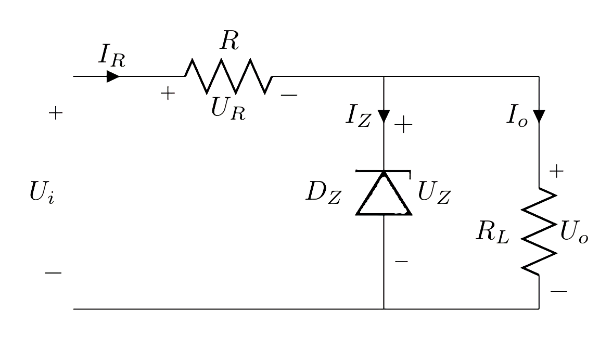

# Shunt voltage regulators

Shunt 分流

```text
    (0, 0) to [short, i=$I_R$](1, 0)
    to [R, l=$R$, v_<=$U_R$](3, 0)
    to (4, 0)

    (4, 0) to (6, 0)
    to [short, i_=$I_o$](6, -1)
    to [R, l_=$R_L$, v^<=$U_o$](6, -3)

    (4, 0) to [short, i_>=$I_Z$](4, -1)
    (4, -3) to [zD-, l=$D_Z$,  v_>=$U_Z$](4, 0)

    (6, -3) to (0, -3)

    (0, 0) to [open, v<=$U_i$](0, -3)
```


Let me explain these symbols for you:

$$U_i$$ = $$Voltage_{\text{ } of \text{ } input}$$

$$I_R$$ = $$Current_{\text{ } of \text{ } Resistance}$$

$$U_R$$ = $$Voltage_{\text{ } of \text{ } Resistance}$$

$$I_Z$$ = $$Current_{\text{ } of \text{ } Zener-Diode}$$

$$D_Z$$ = $$Diode_{\text{ } of \text{ } Zener}$$

$$U_Z$$ = $$Voltage_{\text{ } of \text{ } Zener-Diode}$$

$$I_o$$ = $$Current_{\text{ } of \text{ } output}$$

$$U_o$$ = $$Voltage_{\text{ } of \text{ } output}$$

$$I_R = I_s = I_{source}$$

$$I_R = I_s = I_Z + I_o$$

* Variations in Load Current If the current in the load Iout tends to fall, the voltage across the load would tend to rise, but because it is connected in parallel with the diode the voltage will remain constant. What will change is the current \($$I_Z$$\) through the diode. This will rise by an amount equal to the fall of current in the load. The total supply current $$I_s$$ being always equal to $$I_Z + I_{out}$$. An increase in load current $$I_{out}$$ will likewise cause a fall in zener current $$I_Z$$, again keeping $$U_z$$ and the output voltage steady.
* Variations in Input Voltage If the input voltage rises this will cause more supply current $$I_s$$ to flow into the circuit. Without the zener shunt regulator, this would have the effect of making the output voltage $$U_{out}$$ rise, but any tendency for $$U_{out}$$ to rise will simply cause the diode to conduct more heavily, absorbing the extra supply current without any increase in $$U_{Z}$$ thus keeping the output voltage constant. A fall in the input voltage would likewise cause a reduction in zener current, again keeping $$U_{out}$$ steady.



Hopelessly, you have to remember some formulas for testing. Don't ask me why, I don't know why either.

$$
\begin{align*}
&\frac{U_{input_{max}} - U_{output}}{R_{min}} < I_{Z_{max}}
\\ \\
&\frac{U_{input_{min}} - U_{output}}{R_{max}} > I_{Z_{min}} + I_{output_{max}}
\end{align*}
$$

