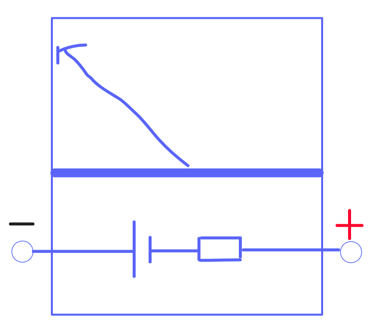

> Measuring the diode's resistance, if the reading indicates infinity in one way and a small value the other way, then the diode is working.
___

> 虽然觉得万用表是垃圾，数字电表才是现在该用的，但老师要教这个，学校要考这个，我也没办法

一切要从万用表说起：

我的意思是，它里面有一块电池和电阻，其中电池是为了有电流测电阻

其中电池的正负极刚好与外部红黑笔的正负相反（我们都知道：红笔接电路正极，黑笔接电路负极）

___

问题1，测出二极管哪边为`P区`(+极)

0. 我们要用电阻档测试二极管
1. 因为我们黑笔出来的是正极，所以如果二极管导通、电阻为0，黑笔接的那一半二极管就是`P区`

___

问题2，什么样的二极管比较好

当然是特性表现得越明显越好: 也就是导通时电阻为0，截止时电阻为$$\infty$$

___

问题3， 量程的选用会影响二极管的阻值吗？

会，不过我们先讲讲什么是`量程`: 就是选择 $$\Omega$$ or $$K \Omega$$ 之类的

1. 万用表电阻档的内阻随着档位的增高而加大
2. $$\because I=\frac{U}{R} \text{, } \therefore R \times 1K \Omega$$ 时二极管处电流小； $$R \times 100 \Omega$$ 时二极管处电流大
3. $$\because R=\frac{U}{I} \text{, } \therefore R \times 1K \Omega \text{时二极管电阻大， } R \times 100 \Omega时二极管电阻小$$
