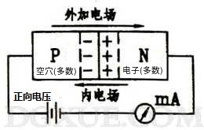

- 基本原理： 物质总是从“高”到“低”流动
- `PN结`的组成：一半`P型半导体`和一半`N型半导体`拼成的整体
- `PN结`产生了什么？
> 0. `P型半导体`空穴多，`N型半导体`电子多，物质由“高”向“低”流动
> 1. P 的空穴跑到了 N，正电粒子跑到了 N， P 变为负极
> 2. N 的电子跑到了 P，负电粒子跑到了 P， N 变为正极

> 3. 中间那条线为正负交界，达到稳定状态，形成`PN结`，该“结”产生的电场所占有的能量被叫做`电动势能`，也被叫做`壁垒高度`
> 4. 硅的`壁垒高度`为0.5V左右，锗的`势垒高度`为0.1V左右；其高度随温度的升高而下降
- `PN结`的特性
$$
\begin{align*}
U_P &> U_N \text{ (电压P > 电压N)}
\\ \\
&\Downarrow
\\ \\
&\text{PN结正向偏置（正偏）}
\\ \\
&\Downarrow
\\ \\
&\text{当 } (U_P - U_N > 0.5\text{(硅)}) \text{ } or \text{ } (U_P - U_N > 0.1\text{(锗)})
\\ \\
&PN结被导通
\\ \\
&\text{当 } (U_P - U_N) \text{ 达不到 0.5 或 0.1}
\\ \\
&正常情况, 未被导通
\\ \\ \\
\end{align*}
$$

$$
\begin{align*}
&U_P < U_N \text{, 反向偏置}
\\ \\
&\text{此时PN结处于截止状态，电流很小, 可以当成开路}
\end{align*}
$$
