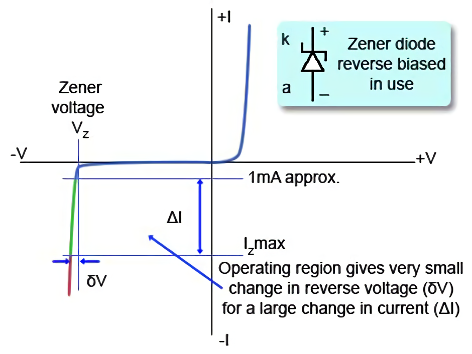
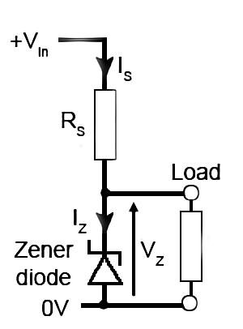

Zener-diode
> a form of semiconductor diode in which at a critical reverse voltage a large reverse current can flow.

___

Zener diodes are made to conduct under reversed bias. Zener diodes are fabricated
to work in the breakdown region under a special tunneling breakdown called Zener
breakdown. This breakdown occurs at a specifically defined value of voltage, as this
breakdown voltage is maintained as the reverse current increases, this diode can be
used as a voltage reference. The breakdown voltage is kept constant even if the cur-
rent changes without damaging the diode.

___

The main property of a zener diode is that the voltage across the diode ($$V_Z$$) will remain practically steady for a wide range of current ($$I_Z$$) when the diode is operated in reverse bias mode:

