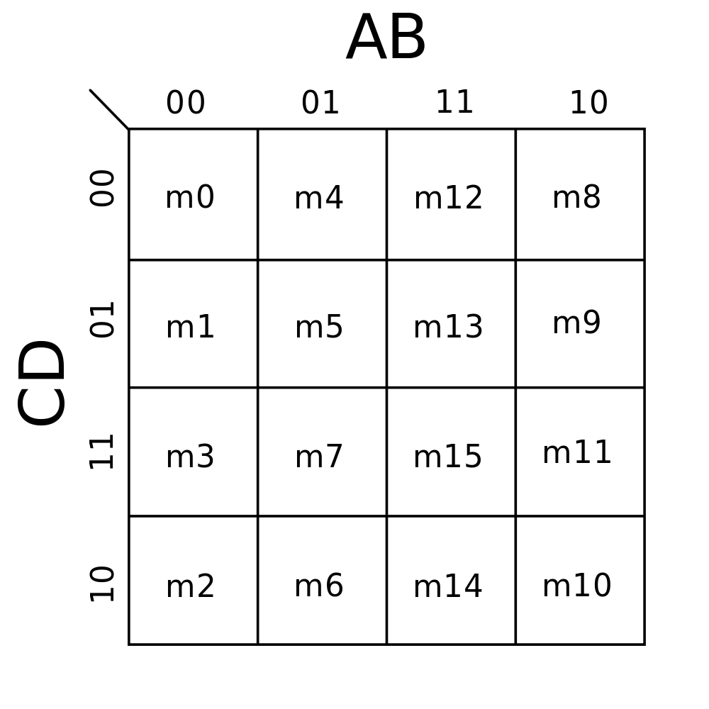

# Karnaugh map

> The Karnaugh map \(KM or K-map\) is a method of simplifying Boolean algebra expressions.

For me, I don't think `karnaugh map` is very important at all. \(just think about any one of modern programming language, and you will know what I'm feeling\)

So I just want to give a picture with a few words. \(Chinese book may not the same with what I show you, it's OK, you have to know China usually don't follow the International Standard, it may because of 知识分子素质太差，一叶樟木，井低观天\)

Here if we set $$1$$ as $$A$$, then $$0$$ is $$\overline{A}$$

Here if we set $$1$$ as $$B$$, then $$0$$ is $$\overline{B}$$

Here $$CD$$ or $$AB$$ both connected to the line besides it.

So you can represent $$m7$$ as $$\overline{A}BCD(01 11)$$，$$m13$$ as $$AB\overline{C}D(1101)$$

Google for more information. or if you know Chinese very well, see following.

1. 翻出你的教材对照着看
2. 该表是个球体，x与y是相连的
3. 为了最简，同一个方格最好只被圈一次
4. 0、1同时出现在`一竖或一横`，消去；`一横或一竖`出现相同的`0或1`，保留
5. 先读AB, 竖着；再读CD，横着（反正随你的图而变）
6. `田字四格`化简程度大于`两个相邻格`

update

1. 翻出你的教材对照着看
2. 该表是个“救生圈”，x与y是相连的，四个角也是相连的\(可以连成一个田字格\)

   

3. 8 &gt; 4 &gt; 2，这里的数字指的是每个圈所圈住的相邻项的个数，尽可能用大圈
4. 为了最简，圈的次数尽量要少
5. 0、1同时出现在`一竖或一横`，消去；`一横或一竖`出现相同的`0或1`，保留
6. 先读AB, 竖着；再读CD，横着（反正随你的图而变）

