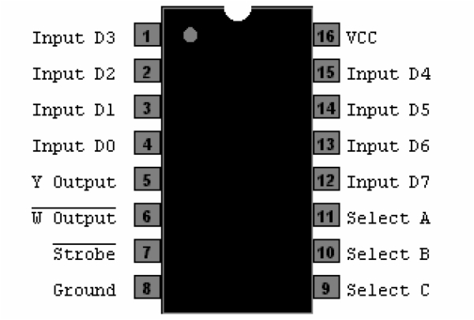

# Multiplexer

Multiplexer or a data selector contains the following:

1. n number of inputs of the multiplexer
2. only one output of the multiplexer
3. m select/Address lines
4. one strobe/enable input \(optional\)

All inputs and outputs should be purely logical or binary input.

For `n : 1` multiplexer, each input will be selected at the single output at any instant of time, depends upon the input applied to the select/address inputs. Switching circuit connects a particular input to the output

Here `m` and `n` are related by $$2^m = n$$

So for a `4 : 1` multiplexer, `the number of inputs` is `4` and `m = 2` \($$2^2 = 4$$\)

A、B、C 三个`pin(管脚)`是3个`2进制数(0 or 1)`，被用来表示$$D_{number}$$中的`10进制` `number`

之所以说 $$D_{number}$$ 是`input`， 是因为当你的 A、B、C 三个`pin(管脚)`输入的`2进制`刚好表示 $$D_{number}$$ 中的 $$number$$ `10进制`时，`OUTPUT Y`会输出对应的 $$D_{number}$$ 的高低电平，比如：

`A`、`B`、`C`都给`0`，`D0`给1，那么`Y`就输出`1`

这样就实现了数据选择器顾名思义的功能: 通过`A`、`B`、`C`三个输入，控制`Y端口`输出_对应的_`D0`_~_`D7`_的输入值_

Let us consider, a `4 : 1` multiplexer having `4` inputs, `2` select lines, one output, one strobe inputs. `Strobe inputs` should be grounded for enabling the multiplexer and can perform its intended function.

默认情况下，英文书上写的，如果你让 `Strobe pin` 输入`0`，`mutiplexer`正常工作；输入`1`，停止工作

但根据国情和大学的教学水平以及英语翻译能力，国内的教科书可能不一样

Commercial multiplexers will be

`2 : 1`, `4 : 1`, `8 : 1`, `16 : 1`, `...`

`m = 1`, `m = 2`, `m = 3`, `m = 4`

这里是讲的是，商用的`mutiplexer`有以上种类

国内数子电子课程为了节省电子元件，可能会让你用 `multiplexer` 做`三人表决电路`的实验，原理很简单，原来的输入变成`A`、`B`、`C`，原来应该返回`1`或`0`的地方_用_`把D连起来`_方法批量的输入_`1`_或_`0`

