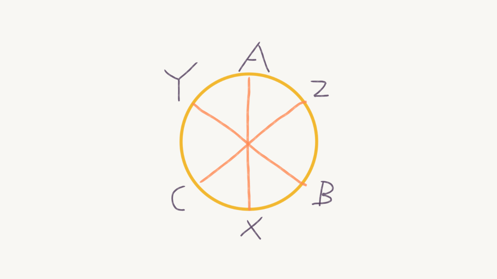

# 三相电

三相XX所形成的一个体系就是三相制，它是由三个频率和振幅相同、相位互差 $${90}^\circ$$ 的正弦交流同时供电的系统。（由于三个电源的唯一不同点是相位，我们用这个不同点为它命名，所以叫它“三相”）

我国电力系统的供电方式几乎全是三相制。（至于为何用三个电源而不是用其他个数，大概是“三”符合三角形稳定结构吧）

前面说了，三相交流电由三个交流电源组成，于是它有正负极三对接口，分别为 $$AX$$、$$BY$$、$$CZ$$，其中 $$A$$、$$B$$、$$C$$ 为正极， $$X$$、$$Y$$、$$Z$$ 为负极

假设上图的转盘通过转动产生电力，转速不变，对每个电源来讲，频率相同，但由于每根电源线（或绕组）之间相差 $${120}^\circ$$，这使得它们发电的先后顺序有了差别，即相位互差 $${120}^\circ$$

以电压为例，如果我们写出它们各自的完全交流电表达式，它将会是这样：

$$
\begin{align*}
U_A &= U_{max} \sin{wt}
\\ \\
U_B &= U_{max} sin{(wt-{120}^\circ)}
\\ \\
U_C &= U_{max} sin{(wt-{120}^\circ-{120}^\circ)} = U_{max} sin{(wt+{120}^\circ)}
\end{align*}
$$

注：这里补点基础，电路的交流电表达式的相位不允许有 $$(-\infty, {-180}^\circ)$$ or $$({180}^\circ, +\infty)$$ 这种情况发生，而我们知道 $$\sin{x}$$ 的周期是 $$2 \pi$$，加减周期原函数值不变，所以 $$\sin(-240^\circ) = \sin(-240^\circ + 360^\circ) = \sin(120^\circ)$$

把完全解析式写成向量形式，我们得到：

$$
\begin{align*}
\dot U_A &= U \angle{0^\circ}
\\ \\
\dot U_B &= U \angle{-120^\circ}
\\ \\
\dot U_C &= U \angle{120^\circ}
\end{align*}
$$

把三个电压相加，模长 $$U$$ 相同\(有效电压相同\)，方向相反，交流电压相互抵消，合为零

