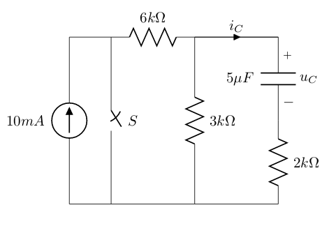

# 零输入响应

零输入响应： 把输入的电压或电流降为零，看电路中的元件有什么反应（主要看电感和电容）。

本质上就是电路从有电到没电后的一段时间发生了什么，这时我们求出的东西不是一个具体的值，而是一个关于时间t的函数。这个函数反映了`电感或电容`的`电压值或电流值`在断电后随时间的变化情况。

1. 首先我们应该明确的一点是：`电感的电流`或`电容的电压`在电路发生改变前和电路发生改变后都不会改变。
2. 电感和电容都是储能元件，它们都会在断电之后起一个临时电源的作用。
3. 他们存储的电会随时间而流逝，我们可以通过数学式把这个过程精确地表示出来。

$$
\begin{align*}
\\
& 其关于时间 t 的表达式 = 改变后的稳态值 \cdot e^{- \frac{t}{\tau}}
\\ \\
& \text{如果是 Capacitor 在释放电， } \tau = R \cdot C
\\ \\
& \text{如果是 Inductor 在释放电， } \tau = \frac{L}{R}
\\ \\
\end{align*}
$$

注意!

这里的 $$R$$ 是指：相对于储电的`Capacitor`或`Inductor`而言，以`Capacitor`或`Inductor`为电流出发点，流过的电阻总值

这里的 $$C$$ 和 $$L$$ 是分别指的是`Capacitance value`和 `Inductance value`

图示电路原已达到稳态，在 $$t=0$$ 时开关 $$S$$ 合上。试求 $$t \geq 0$$ 时 的电容电压 $$u_C(t)$$ 及电流 $$i_C(t)$$



```text
    \draw (0, 0) to [I=$10mA$](0, 4)
    to (1, 4)
    (1, 4) to [closing switch, l=$S$](1, 0) to (0, 0)
    (1, 4) to [R=$6k\Omega$](3, 4)

    (3, 4) to [R=$3k\Omega$](3, 0) to (1, 0)
    (3, 4) to [short, i=$i_C$](5, 4)
    to [C, l_=$5\mu F$, v^=$u_C$](5, 2)
    to [R=$2k\Omega$](5, 0)
    to (3, 0);
```

$$
\begin{align*}
\\
\text{1. } & \text{When switch off, 电容遇直流电断路}
\\ \\
& u_C(0_-) = 10mA \cdot 3k \Omega = 30V
\\ \\
& u_C(0_+) = u_C(0_-) = 30V
\\ \\
\text{2. } & \text{Accrding to 公式}
\\ \\
& \tau = R \cdot C = (3k \Omega \text{ // } 6k \Omega + 2k \Omega) \cdot 5\mu F 
\\ \\
& = 4k \Omega \cdot 5\mu F = 20 \times 10^{-3} s
\\ \\
& u_C(t) = u_C(0_+) \cdot e^{- \frac{t}{\tau}} = 30 \cdot e^{-\frac{t}{20 \times 10^{-3}}}
\\ \\
& = 30 \cdot e^{-50t} V
\\ \\
\text{3. } & \text{Accrding to ohm's law, with Capacitor release power}
\\ \\
& i_C =- \frac{u_C(t)}{R} \cdot e^{-50t} = - \frac{30}{4} \cdot e^{-50t}
\\ \\
& = -7.5 \cdot e^{-50t} A
\end{align*}
$$

