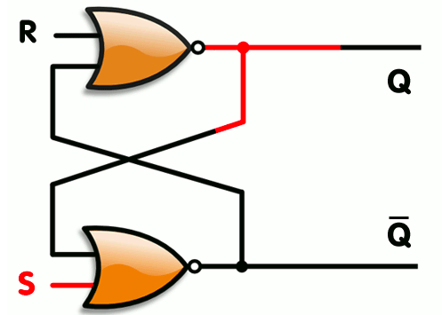

# Flip-flop (触发器)

触发器（英语：Flip-flop, FF），中国大陆译作“触发器”、台湾及香港译作“正反器”，是一种有两种稳态的用于储存组件，可记录二进位制数字信号“1”和“0”。

触发器可以分成几种常见的类型： SR(设置－重置，"set-reset"), D(数据或延迟，"data" or "delay"), T(反转，"toggle")，和 JK。

___

#### RS触发器

基本RS触发器又称SR锁存器，是触发器中最简单的一种。

$$
\begin{align*}
&S: &0, 0, 1, 1
\\
&R: &0, 1, 0, 1
\\
&Q_{next}: &Q, 0, 1, x
\\ \\
&\text{x means 不允许}
\end{align*}
$$

> Anyway, if you use computer, these things doesn't matter.
