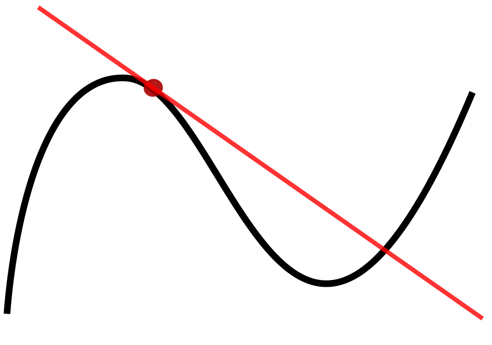

# Tangent Line

**Tangent**: In geometry, the tangent line \(or simply tangent\) to a plane curve at a given point is the straight line that "just touches" the curve at that point.

### key concept 1

The equation for the slope of the tangent line to $$f(x)$$ is $$f^\prime(x)$$.

$$f^\prime(x)$$ is the derivative of $$f(x)$$.

You can always get the slope of the tangent line by using $$f^\prime(x)$$.

> `f(x)` is nothing but a function or formula.

### key concept 2

And a line equation could be represent as:

* the `slope-intercept formula`: $$y = mx + b$$ \(Where $$m$$ is the slope of the line, and $$b$$ is the y-intercept\)

> The equation of any straight line, called a `linear equation`, can be written as: `y = mx + b`, where `m` is the `slope of the line` and `b` is the `y-intercept`.

* the `point-slope formula`: $$y - y_1 = m(x - x_1)$$ \(This formula uses a point on the line, denoted by $$(x_1, y_1)$$, and the slope of the line, denoted by $$m$$, to calculate the slope-intercept formula for the line\)

> `Point-slope` is the general form `y-y₁=m(x-x₁)` for linear equations. It emphasizes the `slope of the line` and `a point on the line`.

## Question and Answers

### `Area of a triangle` is $$18$$. The triangle is enclosed by a `Cartesian coordinate system` and `a tangent`. The equation of the tangent to the curve $$y = x^{-\frac{1}{2}}$$ is at the point $$(a, a^{-\frac{1}{2}})$$. What's the value of $$a$$?

> The answer is `64`

#### we should try to understand the question sentence by sentence first.

**1.Area of a triangle is :**

**2. The triangle is enclosed by a Cartesian coordinate system and a tangent.**

* `tangent` is a line
* the `triangle` was created by the `Cartesian coordinate system` and `the tangent line`

**3. The equation of the tangent to the curve  is at the point .**

The slope of the tangent line is:

$$
\begin{align*}
\text{Let's say } f(x) &= x^{-\frac{1}{2}}
\\ \\
slope = f^\prime(x) &= -\frac{1}{2}x^{-\frac{1}{2}-1}
\\
&= -\frac{1}{2}x^{-\frac{3}{2}}
\\ \\
slope = f^\prime(a) &= -\frac{1}{2}a^{-\frac{3}{2}}
\end{align*}
$$

Now we already have a point and a slope, then we can generate `the equation of the line`:

$$
\begin{align*}
y - y_1 &= m(x - x_1)
\\ \\
y - a^{-\frac{1}{2}} &= (-\frac{1}{2}a^{-\frac{3}{2}}
)(x - a)
\end{align*}
$$

If we could get the x, y in the following picture, we can find an equation of `the area of the triangle`:

$$
\begin{align*}
y - a^{-\frac{1}{2}} &= (-\frac{1}{2}a^{-\frac{3}{2}})(x - a)
\\ \\
\text{when x = 0: } &
\\ 
y - a^{-\frac{1}{2}} &= (-\frac{1}{2}a^{-\frac{3}{2}})(0 - a)
\\
y - a^{-\frac{1}{2}} &= (-\frac{1}{2}a^{-\frac{3}{2}})(- a)
\\
y - a^{-\frac{1}{2}} &= \frac{1}{2}a^{-\frac{3}{2} + 1}
\\
y - a^{-\frac{1}{2}} &= \frac{1}{2}a^{-\frac{1}{2}}
\\
y &= \frac{1}{2}a^{-\frac{1}{2}} + a^{-\frac{1}{2}} 
\\
y &= \frac{3}{2}a^{-\frac{1}{2}}

\\ \\
\text{when y = 0: } &
\\
0 - a^{-\frac{1}{2}} &= (-\frac{1}{2}a^{-\frac{3}{2}})(x - a)
\\
- a^{-\frac{1}{2}} &= (-\frac{1}{2}a^{-\frac{3}{2}})(x - a)
\\
- a^{-\frac{1}{2}} &= (-\frac{1}{2}a^{-\frac{3}{2}} \cdot x) - (-\frac{1}{2}a^{-\frac{3}{2}} \cdot a)
\\
- a^{-\frac{1}{2}} &= (-\frac{1}{2}a^{-\frac{3}{2}} \cdot x) + (\frac{1}{2}a^{-\frac{3}{2}} \cdot a)
\\
- a^{-\frac{1}{2}} &= (-\frac{1}{2}a^{-\frac{3}{2}} \cdot x) + (\frac{1}{2}a^{-\frac{3}{2} + 1})
\\
- a^{-\frac{1}{2}} &= (-\frac{1}{2}a^{-\frac{3}{2}} \cdot x) + (\frac{1}{2}a^{-\frac{1}{2}})
\\
- a^{-\frac{1}{2}} - (\frac{1}{2}a^{-\frac{1}{2}}) &= (-\frac{1}{2}a^{-\frac{3}{2}} \cdot x)
\\
(-1 - \frac{1}{2})a^{-\frac{1}{2}} &= (-\frac{1}{2}a^{-\frac{3}{2}} \cdot x)
\\
(- \frac{3}{2})a^{-\frac{1}{2}} &= (-\frac{1}{2}a^{-\frac{3}{2}} \cdot x)
\\
- \frac{3}{2}a^{-\frac{1}{2}} &= -\frac{1}{2}a^{-\frac{3}{2}} \cdot x
\\
\frac{- \frac{3}{2}a^{-\frac{1}{2}}}{-\frac{1}{2}a^{-\frac{3}{2}}} &= x
\\
(-\frac{3}{2} \cdot -\frac{2}{1})\frac{a^{-\frac{1}{2}}}{a^{-\frac{3}{2}}} &= x
\\
(-\frac{3}{2} \cdot -2)\frac{a^{-\frac{1}{2}}}{a^{-\frac{3}{2}}} &= x
\\
3 \cdot \frac{a^{-\frac{1}{2}}}{a^{-\frac{3}{2}}} &= x
\\
3 \cdot a^{(-\frac{1}{2}) - (-\frac{3}{2})} &= x
\\
3 \cdot a^{(-\frac{1}{2}) + (\frac{3}{2})} &= x
\\
3 \cdot a^1 &= x
\\
3 \cdot a &= x
\\
3a &= x

\\ \\
\text{area of triangle} &= \frac{1}{2} \cdot height \cdot width
\\
18 &= \frac{1}{2} \cdot y \cdot x
\\ 
18 &= \frac{1}{2} \cdot \frac{3}{2}a^{-\frac{1}{2}} \cdot 3a
\\
18 &= (\frac{1}{2} \cdot \frac{3}{2} \cdot 3) \cdot a^{-\frac{1}{2}} \cdot a
\\
18 &= (\frac{9}{4}) \cdot a^{-\frac{1}{2}} \cdot a
\\
18 &= (\frac{9}{4}) \cdot a^{-\frac{1}{2} + 1}
\\
18 &= (\frac{9}{4}) \cdot a^{\frac{1}{2}}
\\
18 \cdot \frac{4}{9} &= a^{\frac{1}{2}}
\\
8 &= a^{\frac{1}{2}}
\\
8 &= \sqrt{a}
\\
8^2 &= (\sqrt{a})^2
\\
64 &= a
\\
a &= 64
\\
\end{align*}
$$

So, finally, we have got the value of a, which is `64`.

