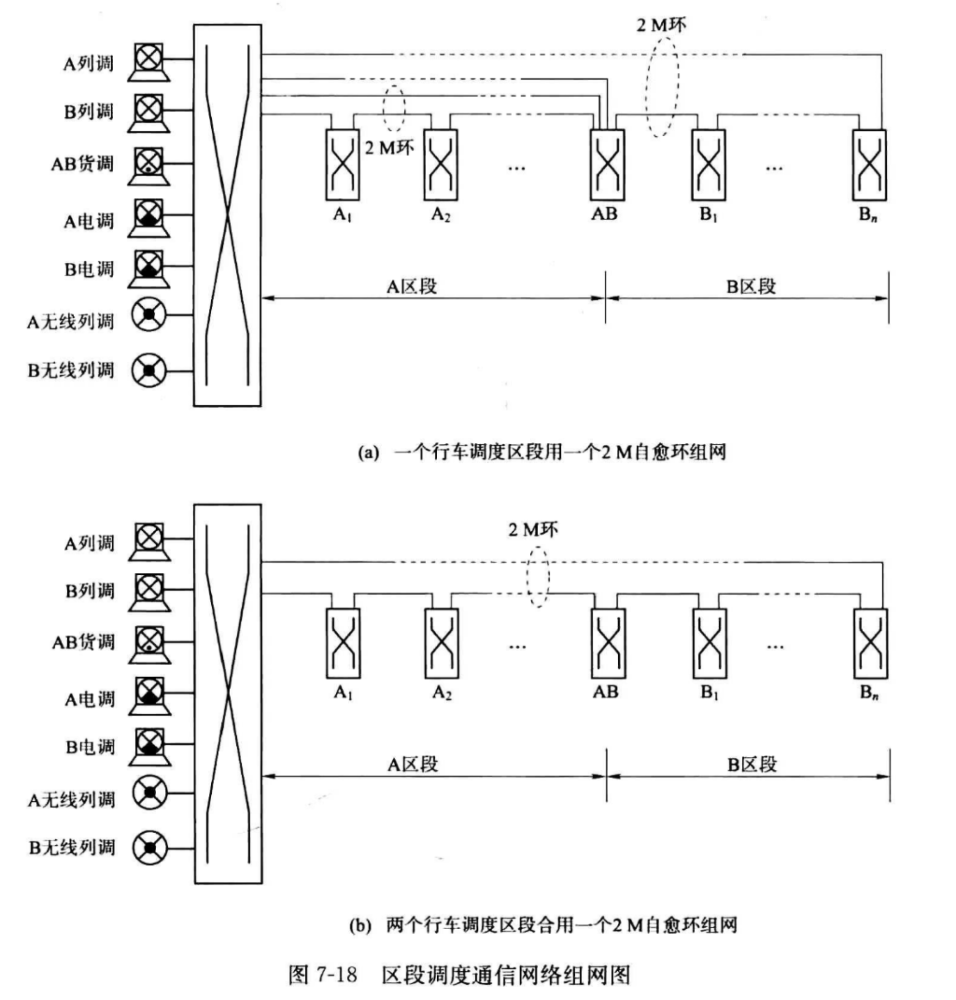
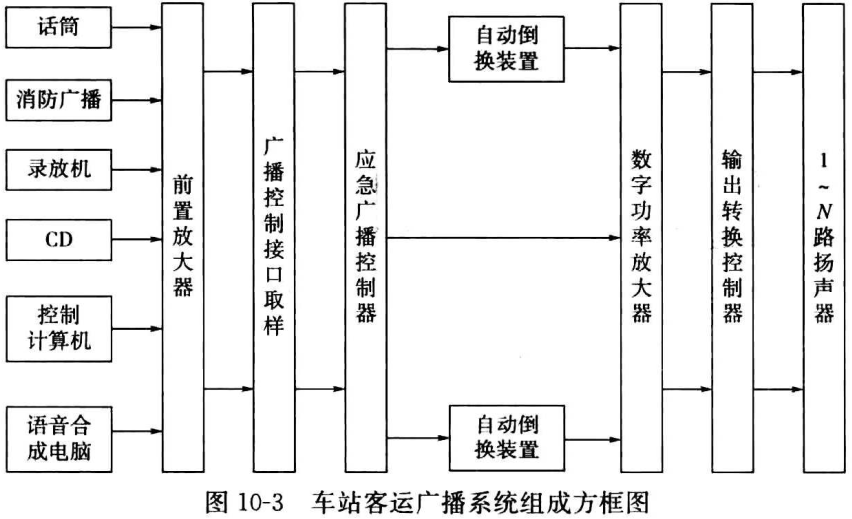
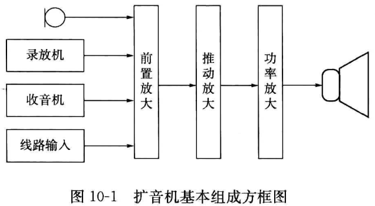
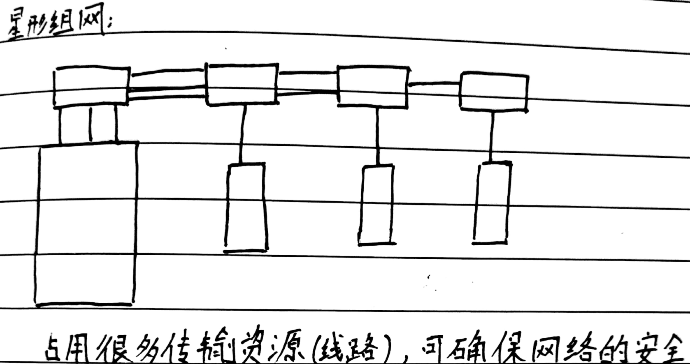
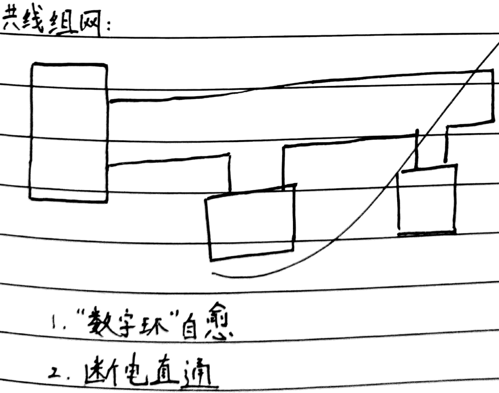
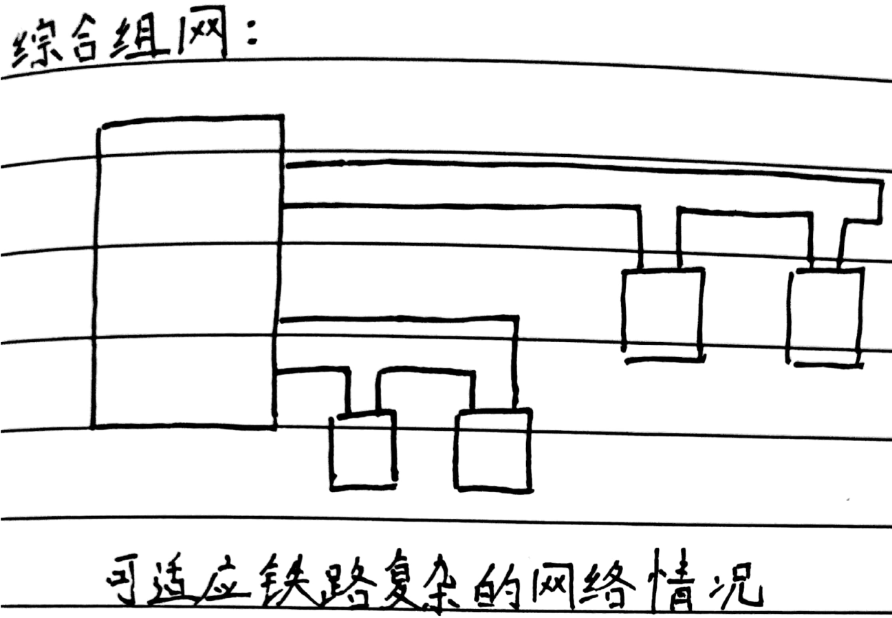
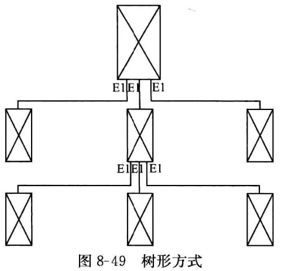

# Everything is for the exam

## 掌握铁路专用通信的业务具体种类、作用。

调度、站内、站间、区间

## 掌握铁路专用通信的特点和要求。

* 特点：实时、安全可靠
* 要求：模拟与数字兼容；支持多种业务；安全可靠；集中维护

## 列车调度电话有什么特点和要求?它与站调有什么不同?

* 特点：指挥列车运行；调度员指挥，值班员汇报；以调度员为中心，一点对多点通信；环状网络结构
* 要求：独立封闭；无阻塞通信；一键直呼、组呼

## 铁路话音通信业务是如何分类的？

* 普通电话
* 专用电话
* 电话会议
* 广播业务

## 铁路调度电话业务是如何分类的？

列车、客运、货运、机车、牵引、...

## 铁路应急通信业务有哪些？

静止图像、动态图像、数据

## 说明铁路调度通信的特点和要求。

* 特点: 为铁路运输服务，由干线与区段调度系统组成。可实现很多通信业务。干线网络结构为复合星形，区段网络结构为环形。
* 要求: 可靠。

## 说明站场通信

站场通信有两种 , 一种是大型车站多个作业场, 调度员与值班员构建的1对多调度； 另一种是站内值班员与若干个站内用户之间构建一点对多点的站内通信

## 调度通信业务有哪些？其主要功能是什么？

列车调度通信、货运调度通信、牵引变电调度通信、其他调度及专用通信、站场通信、应急通信、施工养护通信和道口通信 等

## 数字调度通信系统主要业务、功能、特点、安全保护措施

* 业务：区段调度、站场、站间、 区间、专用通信;
* 功能：DXC、PBX和自动电话延伸、集中维护管理；通道保护
* 特点：自愈环、断电保护、数字模拟兼容、热备份

## 铁路调度通信设备特点、主要机盘作用

* 电源模块：提供电源
* 控制模块：对调度主机的交换网络、各种资源、各种接口的控制与管理
* 交换模块：实现全系统的网络交换功能
* 资源模块：提供系统所需的各种公共资源
* 时钟模块：提供各种时钟、时序信号
* 接口模块：提供接口

## 了解数字会议电路的基本原理

将 PCM 信号变为 模拟信号，再将模拟信号叠加，最后再转为 PCM 信号

## 了解回波相消技术原理。

采用DSP数字信号处理技术，对回波信号进行自适应预估，并将其消除

## 了解数字锁相环技术原理。

利用数字锁相环技, 可以使本系统时钟与上级时源的频率和相位同步, 从而达到两个系统同步的目的。

## 简述数字调度通信系统组成及各部分作用。

* 数字调度主机：网络和通道管理、组网、呼叫处理、交换及各种通信业务的综合接入
* 操作台：终端显示、操作
* 集中维护管理系统：性能管理，配置管理，故障管理，安全管理 等

## 说明数字调度主机组成及各部分作用。

* 电源模块：提供电源
* 控制模块：对调度主机的交换网络、各种资源、各种接口的控制与管理
* 交换模块：实现全系统的网络交换功能
* 资源模块：提供系统所需的各种公共资源
* 时钟模块：提供各种时钟、时序信号
* 接口模块：提供接口

## 简述数字调度主机的主要接口的种类及功能。

* 2M接口
* “2B十D“接口
* 用户接口
* 共分接口\(环路接口\)
* 磁石接口
* 下行区间接口
* 上行区间接口
* 2/4 线音频接口
* 模拟调度接口
* 选号接口

## 简述数字调度系统主要业务及功能。

* 业务：区段调度通信、专用通信、站场通信、站间通信、区间通信
* 功能：DXC功能、PBX和自动电话延伸功能

## 画图说明区段调度通信网络的组成。

## 区段调度通信网络有什么的特点。88P

数字共线形的通信网络、由 2 M 自愈环组成

## 了解FAS系统的概念。

FAS\(Fixed users Access Switching\)系统

## 了解FAS系统的组网方式。

FAS 系统按 铁路总公司至铁路局 和 铁路局至站段 二级结构组网。

## 掌握铁路数字专用通信系统特点、主要业务、功能、网络结构。

## 掌握主系统、分系统作用、组成、主要盘作用、容量、工作呼叫过程。

### FH98:

#### 主系统:

**作用：用于各个铁路局或调度中心**

**组成：**

* 后台由 主控层、数字模块层、模拟模块层、扩展模块层 组成
* 前台由 操作台、2B+D接口 组成

**主要盘作用：**

* 主控板： 存储控制，提供时钟，提供时隙，与各接口、调度台、监控台通信，交换各接口的语音通道
* 音源板： 提供铃音等提示音； 提供数字模块的驱动电路
* 会议板：提供会议功能； 提供连接 接口模块层 的驱动电路
* 主数字板： 提供两个E1接入；码行变换，HDB3转PCM
* 时钟板：采集外部时间，向系统提供时间
* 信令板： 负责处理通信协议
* 模调总机板：...

**容量：**

* E1数字接口： 24
* 2B+D接口： 60
* 模拟接口： 180
* 最多配接调度台： 48
* 最多可接入数字环： 12
* 一个”数字环“最多可挂接分系统数： 50

#### 分系统:

**作用：用于各车站或小的调度中心**

**组成：**

* 后台： 分标准层、模拟接口扩展层
* 前台： ...

**主要盘作用：**

* 背板： 提供插槽和背板
* 分主控板： 实现512x512交换网络
* 分数字板： 处理各种数字信号
* 区转机板： 处理区间电话
* 选号板： 提供选号接口
* 数据通信板： 处理数据（偏指远程维护）

**容量：**

* E1数字接口： 4
* 2B+D接口： 46
* 模拟接口： 138
* 最多配接值班台： 15

### MDS:

#### 主系统:

**作用：**

用作调度、FAS系统，可以进行多媒体通信

**组成：**

包括 MDS3400 交换平台、VT200一体化触摸屏终端、JK24按键式调度终端、统一网管系统 Anymanager

**主要盘作用：**

* DTL板: 数字中继板，提供E1接口
* DLL板: 数字环板，提供数字环E1接口
* DSL板: 提供“2B+D”接口与调度台连接
* ASL板: 共电用户接口板
* MIL板: 提供母板和子板
* RSU板: 会议资源板
* IPU板: IP接口板

**容量：**

* 交换容量: 4096x4096
* 最多 112 个E1、80个数字环
* 最多 3136 个用户
* 会议方最多可以有1920

#### 分系统:

和主系统用的是同一套设备

### CTT2000:

#### 主系统:

**作用：**

* 调度电话
* 站场通信
* 站间通信
* 区间通信
* 区间抢险通信
* 数字录音
* 自动电话接入
* 音频通道接入
* 数字通道接入
* 站场广播接入

**组成：**

电源单元、控制交换单元、接口单元

**主要盘作用：**

* MPA、MPB为系统主处理板，为系统提供时序、信号音、语音，提供32套 MFC 和 DTMF 收发器和 “2x64”方会议资源
* DTP为数字中继处理机板：
* DSP 为数字用户信令处理机板: 处理U口、调度台发过来的信令
* TNI 为音频选号接口板
* ALC为接口模块母板
* SLICM为用户接口模块
* RCTNM为环路接口模块
* ZCT2M 为磁石接口模块
* E/M 接口模块
* VF2M 为2线音频接口模块
* VF4M 为4线音频接口模块
* ZCT2M为上行区间接口模块
* SLICMQ为下行区间接口模块

**容量：**

* 网络容量: 1024x1024
* 模拟接口: 512
* 数字用户: 256
* 调度台: 64
* 数字中继: 32个A口
* 会议资源: 4x64=256
* DTMF资源: 64套
* MFC资源: 64套
* 信号音: 16种
* 语音: 8x8 s

#### 分系统:

和主系统用的是同一套设备

### CTT4000:

#### 主系统:

**作用：**

* 调度业务
* 站场通信
* 站间通信
* 应急通信
* 施工养护通信
* 道口通信
* 电话补充业务
* 数据业务

**组成：**

由16模块组成

**主要盘作用：**

* MPU板: 模块处理机板
* CLK板: 时钟板
* ENT板: 100M以太网板
* PWR板: 电源板
* DTU板: 数字中继处理机板
* "30B+D"板: DSS1信令处理机板
* SS7板: 7号信令处理机板
* DDU板: 2M调度台处理机板
* DSU板: 数字用户信令处理机板
* ALC板： 接口模块母板

**容量：**

* 最大模块数: 16
* 分布式网络容量: 8192时隙
* 单模块网络: 16384x16384
* 单模块运用时，每个模块最大768门，整个系统12288门
* 单模块2M接口： 24个
* 单模块用户接口: 256
* 单模块会议资源: 256方
* 单模块DTMF: 128套
* 单模块语音: 32种
* 单模块信号音: 64种

#### 分系统:

和主系统用的是同一套设备

## 掌握MDS、CTT4000系统特点。152P

### MDS:

交换平台, 能用作 专用调度交换机 、FAS 交换机、公务电话交换机、人工话务台交换机, 能平滑升级。支持电交换和软交换。 能用作监控系统和会议系统，支持电路和IP组网。支持客由单纯的话音向多媒体指调度平滑过。支持“1 十 1“ 保护。

### CTT4000:

* 模块化设计
* 全分散控制
* 分布式结构
* 容错处理能力
* 公共资源双倍冗余配置
* TDM/IP双网络结构
* 大容量、高性能
* 双系统备份设计
* 兼容性设计

## 掌握MDS、CTT4000主、分系统异同点。

MDS: 主分系统是用的一套设备

CTT4000： 分系统的接入用户量小于主系统，板卡数量少于主系统

## 简述FH98系统主要实现业务功能。

* 调度电话
* 站场通信
* 站间通信
* 区间电话
* 站场广播接入
* 无线调度接入

## 说明枢纽主系统组成及各部分作用。100P

* 主控层：提供系统工作时钟，提供信号，与数字板、接口板、网管终端通信，交换各接口的信息和话音。
* 数字模块层：提供E1口
* 模拟模块层：提供模拟接口
* 扩展模块层：扩展模拟接口

## 说明车站分系统组成及各部分作用。

* 分标准层
* 模拟接口扩展层

## 画图说明值班台呼叫用户工作原理。

1. `值班台`按下按钮，`前台`监测到该操作，上报给`U口板`
2. `U口板`将此操作翻译成`请求占用消号`，发送给`车站分主控板`
3. `车站分主控板`对此消息`进行分析`，根据数据确定`目的分机`所在的位置，将此数据发送给`共电板`
4. `共电板`收到`占用信号`后，让`共电-话机`振铃
5. 当`共电话板`监测到`摘机`后，将`此摘机信号`发送出去
6. `此信号`经过`分主控、U口板`的转发之后，最终到达`值班台`
7. 该`值班台`相应的指示灯`由闪烁变为长亮`，表示呼叫成功，双方可以进行通话了
8. 通话结束后，若`共电话机的人`先挂机，共电板检测到挂机信号，会将它翻译成`挂机信号`，发送到`值班台`
9. `值班台`收到`挂机信号`后，指示灯熄灭，说明对方已挂机

## 画图说明调度台呼叫值班台工作原理。

1. `调度员`按下某按钮，机器上报给`U口板`
2. `U口板`将此操作翻译成`请求占用信号`，发送给`枢纽主控板`
3. `枢纽主控板`对此消息进行`分析`，确定用户所在位置后，将此信号发送到`主数字板`上
4. `主数字板`直接将`此信号`发送到`对应车站分系统`的`分数字板`上
5. `分数字板`将信号转发给`车站分主控板`
6. `车站分主控板`对此信号进行分析，确定`目的分机`所在地，将此信号发送给`U口板`
7. `U口板`收到`请求占用信号`后，将其送到`值班台`，`值班台`上的`指示灯`闪烁并振铃
8. 当`值班员`按下按钮应答时，`U口板`会检测到`应答操作`，将其翻译为`应答信号`，发送给`车站分主控板`
9. 此信号通过`分数字板、主数字板、枢纽主控、U口板`的转发后，最终到达`调度台`
10. `调度台指示灯`由闪烁变为长亮，表示`呼叫通道已建立`，双方现在可进行通话
11. 若`值班员`先挂机，则`车站分系统`的`U口板`会检测到`挂机操作`，将此操作翻译为`挂机信号`，并经过`反向信道`传递给`调度台`，`调度台指示灯`熄灭，表示对方已挂机

## 画图说明调度分机呼叫调度台工作原理。

1. `调度分机`摘机，`共电板`监测到`该操作`，将它翻译成`请求占用信号`，发送给`车站分主控板`
2. `车站分主控板`分析`此占用信号`，确定`最终用户的物理位置`后，将此信号发送给`分数字板`
3. `分数字板`将此信号发送给`主数字板`
4. `主数字板`将此信号转发给`枢纽主控板`
5. `枢纽主控板`收到`此占用信号`后，确定目的地，将信号转发到`U口板`
6. `调度台`收到`U口板`的信号后，将相应指示灯点亮
7. `调度台`回发`应答信息`， 该信息沿着传输线路到达`共电板`
8. `共电板`收到`应答信息`后，将话路搭通，此时双方进行通话
9. 通话结束，一方向另一方发送`挂机信号`

## 画图说明值班台呼叫值班台工作原理。

1. `值班台A`按下按钮，前台监测到`此操作`，将它上报给`U口板A`
2. `U口板`将此动作翻译成`请求占用消息`，发送给`车站分主控A`
3. `车站分主控A`对此消息进行分析，发送到`分数字板A上`
4. `分数字板`转发消息到`主数字板`
5. `主数字板`将消息转发到`枢纽主控板`
6. `枢纽主控板`对此消息进行分析，确定`目的车站`，并将此消息发送给相应的`主数字板B`，`主数字板B`转发信息到`值班台B`
7. `值班台B`按下应答键后，回传一个`应答信号`
8. `值班台A`接收到`应答信号`后，指示灯长亮，可以进行通话了
9. 通话结束，一方向另一方发送`挂机信号`

## 试分析比较 FH98系统与MDS3400系统异同点。

* 不同： MDS3400是多媒体终端，支持触屏，支持软交换，支持IP组网，所有业务板可任意混插
* 相同： 都支持基本的调度通信功能、都是模块化设计、都有备份设计

## 试分析比较MDS3400主系统与分系统有什么异同点。

主分系统是用的一套设备

## 简述CTT2000 L/M系统主要实现业务功能。

调度电话、站场通信、站间通信、区间通信、区间抢险通信、数字录音、自动电话接入、音频通道接入、数字通道接入、站场广播接入

## 说明CTT2000 L/M单板配置及单板作用。

* MPA、MPB: 主处理板；为系统提供时序、信号音、语音、会议资源
* DTP: 数字中继处理板；信令处理
* DSP: 数字用户信令处理板
* TNI: 音频选号接口板；接模拟线路
* ALC: 接口模块模板；提供模块插槽
* SLICM: 用户接口模块
* RCTNM: 环路接口模块
* ZCT1M: 磁石接口模块
* VF2M: 2线音频接口
* VF4M: 4线音频接口
* ZCT2M: 上行区间接口模块
* SLICMQ: 下行区间接口模块
* PWR: 电源板

## CTT4000系统有什么特点？

* 模块化设计
* 全分散控制
* 分布式结构
* 容错处理
* 公共资源双倍配置
* TDM/IP双网络
* 大容量、高性能
* 可靠设计
* 兼容设计

## 试分析比较CTT2000 L/M和CTT4000系统异同点。

CTT4000 多了 30B+D 板，多了7号信令处理板，网络容量更大

## 试分析比较CTT4000主系统与分系统有什么异同点。

分系统的接入用户量小于主系统，板卡数量少于主系统

## 了解广播、时钟系统组成、方框图。

## 掌握广播、时钟系统工作原理。

* 广播基本原理: 音工作\(广播\)将数字语音合成器合的数字音, 以及话筒 ,CD 播放器等进 A/D 转换的数字音频进行统一封, 然后过以网传输到远端 \(广播 机械\)数字功率放大,进D/A转, 并通过功率放, 驱动相应的扬声器发声。
* 时钟工作原理：中心时钟向各个分设备提供统一的时钟

## 静态图像传输系统的原理。258

现场通过相机采集静态图像并存储在SD卡上，再由笔记本通过 FTP 方式传回应急中心。应急中心再将图片输出到大屏幕。

## 动态图像传输系统的原理。259P

应急现场通过摄像机集现场动态图像, 然后通过接入设备把视频转为数字信号，再通过铁路应急网络传送到应急中心。应急中心接收到视频后，将其投放到大屏幕。

## 铁路应急通信系统主要有什么组成？254P

铁路应急通信系统主要由 铁路应急中心通信设备、铁路应急通信传输网络、铁路应急现场通信系统组成。

## 静态图像传输系统的功能。258P

完成现场静态图像的采集、传输及接入应急指挥中心的功能, 完成静态图像存储、查询、归档 和 上传至铁路总公司的功能。静态图片大屏显示。

## 动态图像传输系统的功能。259P

完成现场动态图像的采集、压缩/编码、传输及接入应急指挥中心的功能。实时传输动态图像到应急中心，并在大屏显示。

## 判断题

* 音源板提供对数字模块层的驱动电路（ y ）
* 音源板为系统提供各种回铃音和忙音等提示音（ y ）110P
* 列车调度电话的电路是独立封闭型的 （ y ）
* 列车调度电话的电路是共线连接（ y ）
* 四线接口是供接入列车无线调度电话（  ）184-185P
* 数字调度主机通过2B+D接口与操作台连接（ y ）
* 共电接口用以接入站场扩音、广播设备（ y ）
* 磁石接口接人磁石电话用户（ y ）
* FH98数调系统中通话与呼叫是在不同的通道中进行 （  ）99-120P
* FH98是通过站站相连构成2M环网结构 （ y ）
* 交换模块实现全系统的网络交换功能（ y ）
* 调度主系统放置于调度指挥中心（ y  ）
* 站场通信主要通过车站分系统实现 （ y  ）
* U口板提供2B＋D接口（ y ）
* FH98调度主系统配接最大E1数字接口数是24（ y ）
* FH98调度主系统最大配接调度台数是48 （ y ）
* FH98调度分系统模拟接口数是138（ n ）
* FH98调度分系统E1数字接口是4（ n ）
* FH98调度分系统2B＋D接口是46（ n ）
* FH98调度分系统最多配接值班台数是15（ n ）
* 应急分机可替代值班台实现通信业务（ y ）
* FH98调度主系统允许一个数字环上挂接的车站最多50个 （ y ）
* FH98调度系统共分接口可与站场广播系统提供的共电接口对接 （ y ）
* FH98调度主系统模拟接口是180（ y ）
* FH98调度主系统2B＋D接口是60（ y ）
* 电源模块实际上是二次电源（ y ）
* 资源模块提供系统所需的各种公共资源（ y ）
* CTT4000用以实现高铁调度通信（ y ）194P
* 性能管理可显示系统的网络拓扑结构（ y ）203-204P
* 配置管理可以进行网络通道的配置（ y ）
* 故障管理可进行系统所有告警、故障信息的收集 （ y ）
* FH98调度主系统最多可接入数字环数是12（ y ）
* MDS3400系统用于多媒体调度通信（ y ）
* CTT2000L/M模拟接口是512（ y ）183-186P
* CTT2000L/M数字用户接口是256（ y ）
* CTT2000L/M是调度台接口是64（ y ）
* CTT2000L/M数字中继接口是32（ y ）
* CTT2000L/M会议资源是4×64（ y ）
* MPA为CTT-2000L/M系统主处理机板（ y ）184P
* MPB为CTT-2000L/M系统主处理机板（ y ）
* DTP为数字中继处理机板（ y ）
* DSP为数字用户信令处理机板（ y ）
* TNI为音频选号接口板（ y ）
* ALC为接口模块母板（ y ）
* SLICM是用户接口模块\( y \)
* RCTNM是环路接口模块（ y ）
* ZCT1M是磁石接口模块（ y ）
* VF2M是2线音频接口模块（ y ）
* VF4M是4线音频接口模块（ y ）
* ZCT2M是上行区间接口模块（ y ）
* SLICMQ是下行区间接口模块（ y ）
* MDS3400系统能平滑支持各种多媒体通信（ y ）152P
* 站间通信为站与站之间的点对点通信（ y ）
* MDS3400接入的IP终端采用SIP协议（ y ）
* MDS3400系统最大用户数3136（ y ）
* MDS3400系统最多支持112个E1（ y ）
* MDS3400系统能平滑支持IP组网应用（ ）
* 调度通信是以调度员为中心，一点对多点的通信 （ y ）
* MDS3400提供10/100M以太网接口（ y ）
* MDS3400系统最多支持80个数字环（ y ）
* MDS3400系统最大会议方数1920 （ y ）
* MDS3400系统的各种接口都有三级防雷防强电保护 （ y ）
* MDS3400系统同时支持电路交换和IP交换（ y ）
* MDS3400所有业务板可以任意槽位混插 （ y ）
* MDS3400能用作专用调度交换机 （ y ）
* MDS3400可用作路局FAS和车站FAS （ y ）
* MDS3400能用作FAS交换机 （ y ）
* MDS3400能用作公务电话交换机 （ y ）
* MDS3400能用作人工话务台交换机 （ y ）
* MDS3400能同时支持电路交换和软交换 （ y ）
* MDS3400能用作监控系统和视讯会议系统 （ y ）
* MDS3400能接入视频会议系统 （ y ）
* MDS3400能接入监控系统 （ y ）
* MDS3400能同时支持电路和IP组网应用 （ y ）
* MDS3400支持多媒体指挥指挥调度通信 （ y ）
* MDS3400能支持客户从电路交换向软交换平滑过渡。 （ y ）
* CTT4000系统是模块化设计（ y ）
* CTT4000系统是全分散控制（ y ）
* CTT4000系统没有集中控制模块
* CTT4000系统各模块均配置双平面的模块处理机（ y ）
* CTT4000系统各接口模块控制完全独立（ y ）
* CTT4000系统是TDM/IP双网络结构（ y ）
* CTT4000系统是控制模块并行处理（ y ）
* CTT4000系统是分布式结构（ y ）
* CTT4000系统是双系统备份设计（ y ）
* CTT4000系统的组网1．星型组网2．环型组网3．树型组网4．综合型组网5． 双中心组网（ y ）
* CTT4000调度主系统实现全系统的网络和通道管理功能
* CTT4000调度分系统用作站内业务接入功能（ y ）
* CTT4000调度分系统用站内以及调度间呼叫处理和交换功能（ y ）
* 站间通信为站与站之间的点对点通信（ y ）
* 列调通信呈链状结构（ ）
* 定压式扩音机在其电路中采用了深度负反馈电路（ y ）
* OTN系统采用双环网结构（ ）
* 操作台与数字调度主机采用2B+D接口（ y ）
* 环路接口用以接入站场扩音、广播设备（ n ） 107P
* 磁石接口可接入站间闭塞回线或站间模拟通道（ y ）
* 在数字调度系统中通话与呼叫是在不同的通道中进行 （ ）
* FH98可以单机运用完成单一功能的通信设施（  ）
* 时钟模块为系统提供所需的各种时钟、时序信号 （ y ）
* 接口模块实现系统与各终端或设备的接口功能（ y ）
* 数字调度主机通过2B+D接口与操作台连接（ y ）
* 共分接口\(环路接口\)用以接入站场扩音、广播设备（ n ）
* 2／4线音频接口接入各类具有2／4线音频接口的终端（ y ）
* 磁石接口可接入站间闭塞回线（ y ）
* 磁石接口可接入站间模拟通道（ y ）
* FH98分系统放置于管辖范围内各车站（ y ）
* 站间通信是两车站值班员之间进行通信业务（ y ）
* U口板供接入主系统调度台或分系统值班台（ y ）
* 主系统配接最大2B＋D接口数是90（ n ）
* 主系统最多可接入数字环数是12（ y ）
* 分系统最多可接的值班台台数是15（ y ）117P
* 应急分机可替代值班台实现通信业务（ y ）
* 主系统允许一个数字环上挂接的车站最多50个（ y ）
* FH98车站分系统具有区转机功能（ y ）
* 站间通信是两车站值班员之间进行通信业务（ y ）
* 应急分机可替代值班台实现通信业务（ y ）
* 电源模块提供±5 V、±l2 V和铃流 （ n ）114P
* 资源模块提供系统所需的各种公共资源 （ y ）
* 会议资源用以实现系统所需的各种会议功能 （ y ）
* 性能管理可查看主系统和各分系统的运行状况 （ y ）
* 配置管理可以进行主系统和分系统的数据配置（ y ）
* 安全管理可以控制各分维护管理终端的权限（ y ）
* 各MSC之间通过El接口相连接，接口采用N0.7信令（ y ）x
* 铁路局调度交换机至沿线车站的调度交换机通过El接口相连接（ y ）
* MDS3400可用作主系统和分系统（ y ）

## 多项选择题:

#### 区段调度通信有（ ABC ）80P

A.列车调度通信B.货运调度通信C.电力调度通信 D.其他调度通信

#### 区段数字调度通信系统安全保护措施有：（ ABC ）84P

A．数字自愈环B. 断电保护C. 数字／模拟通道互为备份D.市内通信电缆

#### 调度通信组网类型可有（ ABC ）等

A．星型方式 B. 共线方式 C. 综合方式 D. 网型

#### 分系统包括（ ABD ）等接口。116P

A． 2B+D B. 磁石 C. 四线音频 D. 共电

#### 枢纽主系统由（ ABC ）组成。100P

A．后台系统B. 前台操作台C. 网管系统D.电导

#### 集中维护管理系统涵盖了（ ABCD ）功能。84P

A．配置管理B. 性能管理C. 故障管理 D. 安全管理

#### 调度通信业务可归纳为（ ABCD ）通信过程

A．个别呼叫 B. 组呼 C. 会议呼 D. 广播呼叫

#### 扩音机主要有三大部分组成它们是（ ABC ）

A．前置放大器 B. 推动放大器C. 功率放大器 D.电源

#### 干、局线通信有（ ABCD ）

A.干线各种调度通信 B.局线各种调度通信 C.干、局线会议电话D.干、局线会议电视

#### 集中维护管理系统涵盖了（ ABCD ）

A．配置管理 B. 性能管理 C. 故障管理 D. 安全管理

#### 调度组网类型可分为:（ ABC ）等

A．星型方式 B. 共线方式 C. 综合方式 D. 网型

#### 车站分系统包括（ ABD ）等接口。

A．共分 B. 磁石 C. 四线音频 D. 共电

#### 车站分系统由（ ABC ）组成

A．后台交换网 B. 车站值班台 C.调度台 D.电导

#### 会议功能包括（ BCD ）等功能

A．数字共线 B. 全呼 C. 组呼 D. 会议呼

#### 区段调度通信有（ ABCD ）

A.列车调度通信 B.货运调度通信 C.电力调度通信 D.其他调度通信

#### 区段数字调度通信系统安全保护措施有：（ ABC ）

A．数字自愈环 B. 断电保护 C. 数字／模拟通道互为备份 D. 线径0.4mm市内通信电缆

#### MDS系统主要用于（ ABC ）

A．铁路数字调度通信系统 B. FAS调度通信系统 C.多媒体调度系统 D.市内通信

#### 调度通信业务可归纳为（ ABCD ）通信过程

A．个别呼叫 B. 组呼 C. 会议呼 D. 广播呼叫

#### 扩音机按照材质分有（ ABC ）三种

A．晶体管扩音机 B. 集成电路扩音机 C. 电子管扩音机 D. 一体化机

#### MDS系统电路组网方式有（ ABCD ）

A. 数字环 B. 星型方式 C. 双中心网状方式 D. 树型方式

#### MDS系统主要用于：（ ABC ）

A．铁路数字调度通信系统 B. FAS调度通信系统 C. 多媒体调度系统 D. 线径0.4mm市内通信电缆

#### MDS系统IP组网方式有（ ABC ）

A．纯IP单系统组网 B. IP和电路单系统组网 C. IP中继多系统组网 D. 网型

#### FH98分系统包括（ ABD ）等接口。

A．2B+D B. 磁石 C. 四线音频 D. 共电

#### FH98枢纽主系统由（ ABC ）组成

A．后台系统 B. 前台操作台 C. 网管系统 D.电源

#### FH98分系统车站分系统主要功能为（ ABCD ）功能等

A．接入数字调度电话、 B. 接入数字化的专用电话、 C. 站场通信、D. 区转机

#### 会议功能包括（ BCD ）等功能

A．数字共线B. 全呼 C. 组呼 D. 会议呼

#### 集中维护管理系统涵盖了（ ABCD ）四大功能

A．配置管理 B. 性能管理 C. 故障管理 D. 安全管理

#### 调度通信业务可归纳为（ ABCD ）通信过程

A．个别呼叫 B. 组呼 C. 会议呼 D. 广播呼叫

#### 值班台呼叫值班台经过（ ABD ）。

A．一个主系统 B.二个分系统 C. 二段线路 D. 一段线路

#### FAS系统由（ ABCD ）其它各类固定终端及网管终端构成。

A．调度所FAS、 B. 车站FAS、 C. 调度台、D. 值班台

#### IP中继多系统组网中，单个系统可以是（ ABC ）

A．纯电路系统 B.纯IP系统 C. 电路和IP混合系统 D. ATM

#### DTL板（数字中继板）该接口支持（ ABC ）

A．NO.1 B.NO.7 C. DSS1 D. QSIG等信令

#### MDS3400能用作（ ABCD ）

A．专用调度交换机 B.FAS交换机 C.公务电话交换机 D.人工话务台交换机

## 扩音机基本方框图

## 车站值班台呼叫本站共电分机用户工作过程（找故障流程图）

## 车站值班台呼叫本站共分用户工作过程

## 车站值班台呼叫本站磁石分机用户

## 调度台呼叫本数字环内值班台工作过程

## 调度分机呼叫本数字环内调度台工作过程\(5分\)

## 值班台呼叫本数字环内值班台工作过程\(5分\)

## 调度台呼叫本数字环内调度分机工作过程

反向

## 调度系统星型组网

## 调度系统共线组网

## 调度系统综合组网

## 调度系统树型组网

## 车站值班台呼叫站内用户

## 车站值班台呼叫站内共电分机用户

## 车站值班台呼叫本站磁石分机用户

## 车站值班台呼叫本站共分用户

## 南京站值班台呼叫南京站共电分机用户

## 路局调度台呼叫苏州站值班台

## 路局调度台呼叫徐州站值班台

## 路局调度台呼叫南京站值班台

## 路局调度台呼叫滁州站值班台

## 路局调度台呼叫常州站值班台

## 车站调度分机呼叫本环内调度台

## 苏州站调度分机呼叫本数字环内调度台

## 徐州站调度分机呼叫本共线网络内调度台

## 南京站调度分机呼叫本链形网络内调度台

## 滁州站调度分机呼叫本2M环内调度台

## 同一数字环内车站值班台呼叫车站值班台

## 同一共线网络内南京车站值班台呼叫蚌埠车站值班台

## 同一E1环网内滁州车站值班台呼叫南京车站值班台

## 同一链形网络内车站值班台呼叫车站值班台

## 同一2M环网内车站值班台呼叫车站值班台

## 同一数字环内调度台呼叫无锡车站调度分机

## 同一共线网络内调度台呼叫丹阳车站调度分机

## 同一E1环网内调度台呼叫常州车站调度分机

## 同一链形网络内调度台呼叫镇江车站调度分机

## 同一2M环网内调度台呼叫南京东车站调度分机

## 定阻式扩音机特点

扩音机的电路中无负馈或只加少量负反馈。因而它的输出阻抗较高，当负载阻抗变化时，它的输出电压变化较大。

## 定压式扩音机特点

在其电路中采用了深度负反馈电路，因而它的输出阻抗较低。当负载阻抗在大于额定输出阻抗的范围变化时，扩音机的输出电压基本不变。

## 扩音机基本原理

选择信源将微弱信号送入前置放大器进行前级和倒相放大，经倒相放大后的信号在送入推动放大器进一步放大，以获得足够激励信号让末端功率放大器放大，功率放大器信号输出到线路，通过线路变压器匹配让其扬声器发音。

## 2700系列功率放大器自保护功能

2700系列功率放大器设备具有自保护功能，当出现短路、开路、过载、过热、故障等异常现象时，放大器应能自动停止输出，并有指示灯显示。

## 功放倒机

系统中设有功放检测控制器，它时时检测功率放大器的输入与输出信号，当功率放大器出现故障，它会将出现其对应的输入音频切换到备用功率放大器上，同时广播区切换控制器会将备用功率放大器的输出音频切换到相应的广播区。

## 时钟系统主要作用

是为工作人员和乘客提供统一的标准时间，并为所有设备系统提供统一的标准时间信号

## 无线电授时

通过无线电波传播时间信息。

## 网络授时

指根据网络时间协议NTP（Network Time Protocol）传播时间信息。

## 时间同步系统工作原理

时间同步设备通过卫星或地面时间同步链路的输入信号获取时间同步信号，来调控设备内部的时钟和时刻（授时过程）。

## 铁路时间同步网组成

由卫星接收设备、母钟设备、时间显示设备、设备网管和传输通道组成。

## 什么是数调系统的数字环？

每块主数字板提供2个数字接口（E1接口），分别为“上行E1接口”与“下行E1接口”，通过这两个E1口，实现枢纽主系统和数字传输通道连接，并将各车站分系统依次接入，形成调度专用网的“数字环”。

## MDS3400主分系统异同点

佳讯MDS3400数字调度分系统与主系统的功能特点基本一致，区别在于车站分系统接入需求量较少，在MPU交换能力为1024×1024远低于主系统。车站分系统一般只接入上行站和下行站2M通道，分系统DLL多采用2E1或42E1的板件。

## CTT4000主分系统异同点

CTT4000调度分系统与调度主系统的功能特点完全一致。车站分系统与主系统的区别在于由于 接入用户数量小于主系统，在板件配置数量上少于主系统，一般情况下车站分系统只配置主控层和一个扩展层。

## 无铃流电源板作用

* 电源板输入：－48V直流电源
* 电源板输出：＋5V、－5V直流电源
* 为各电路板提供电源。

## 有铃流电源板作用

除提供＋5V、－5V直流电源输出，还提供两种25HZ、75V的铃流源信号，分别向共电接口的用户话机和磁石接口的用户话机送振铃。

