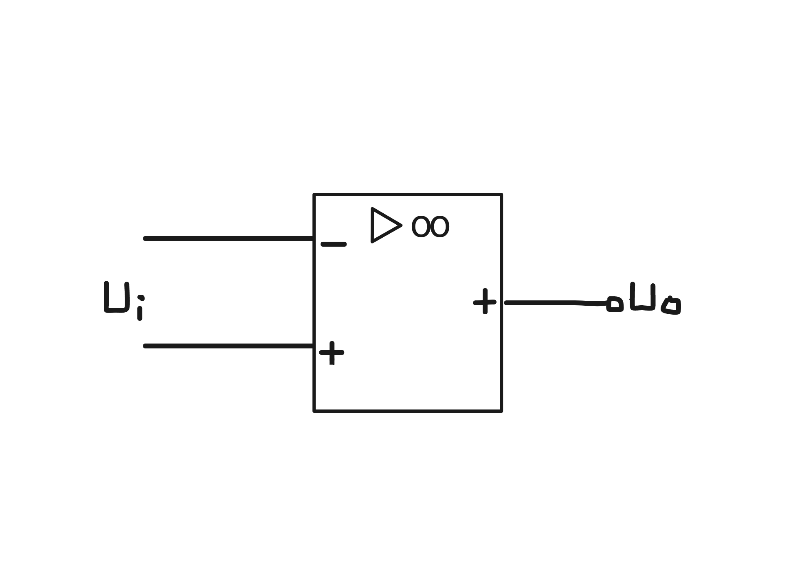
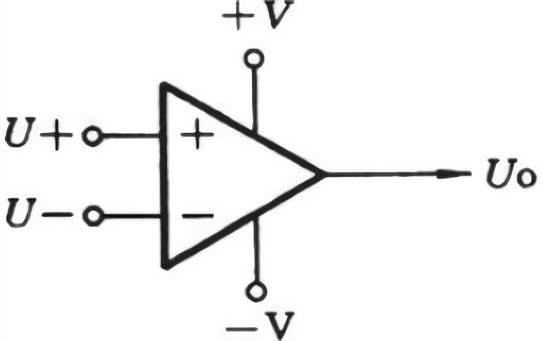
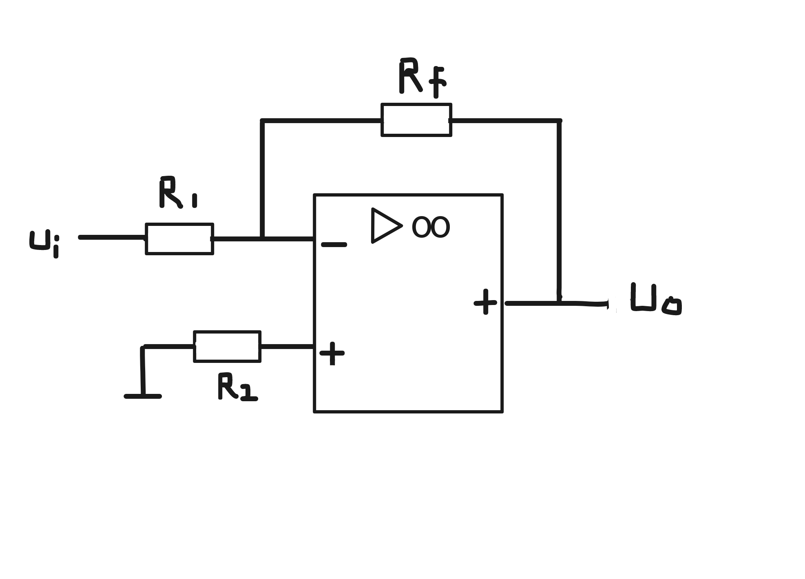

# Integrated Operational Amplifier (集成运算放大器)

In China:

The $$\infty$$ 表示理想中的无限放大

In United States:

___

这里补一个概念：

> **电流为0时可以有电压 （没电流时电压可能存在）**

> 解释： 电压一直有但没回路、没负载，电阻无穷大，电流为0

> **没有电压必然没有电流 （有电流一定有电压）**

> 解释： 因为电流(电子)流动是因为有电压差

___

#### Inversed_Integrated_Operational_Amplifier (反向输入比例运算电路)

$$
\begin{align*}
&\because i_+ = 0 \text{ , } \therefore u_+ = 0
\\ \\
&\because u_+ = u_- \text{ , } \therefore u_- = 0
\\ \\
&\text{ } i_1 = \frac{u_i - u_-}{R_1} = \frac{u_i}{R_1} \text{ , } i_f = \frac{u_- - u_o}{R_f} = \frac{-u_o}{R_f}
\\ \\
&\because u_- = 0 \text{ 无电压就无电流, } \therefore i_1 = i_f
\\ \\
&\therefore u_o = -\frac{R_f}{R_1} u_i
\end{align*}
$$
