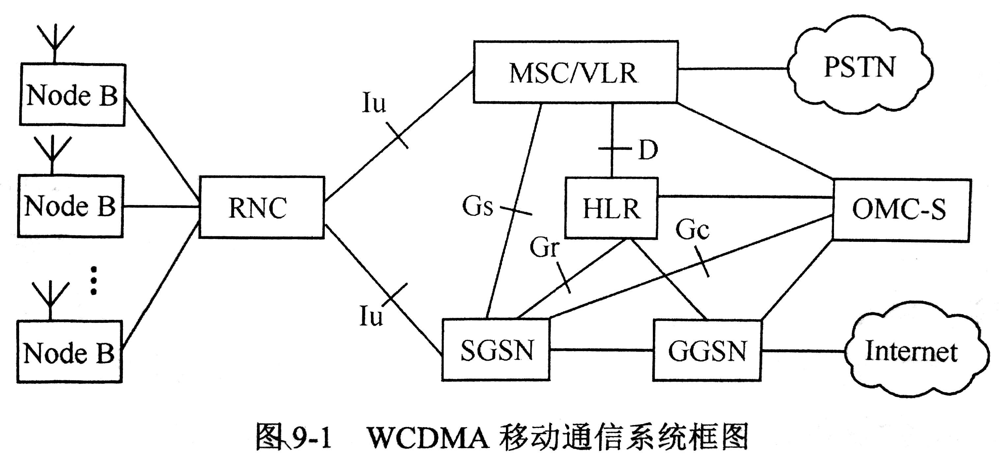
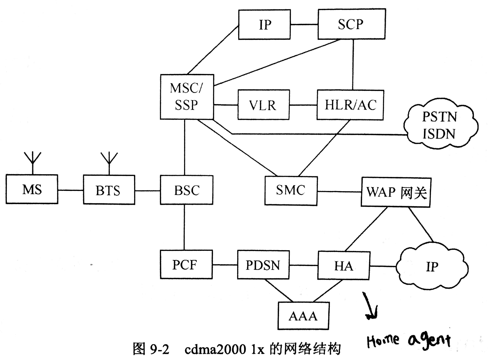

# 3G

话说前面主要学的是2G，也就是 GSM

现在要开始学习 3G 了，接着是 4G

每个 generation 会有具体的、不同的 system，你要记住每个 system 的设备结构图，因为考试有填图题

这里我们重点讲3G：

* TD—SCDMA 中国移动， 中国技术。
* WCDMA 中国联通， 欧洲技术。
* CDMA 2000 中国电信， 美国技术。

## 第三代移动通信系统的主要特点有哪些？

> 特点: 特别的点，特殊的地方，与其他事物不同的地方

* **全球漫游**，使任意时间、任意地点、任意人之间的交流成为可能。\(‘漫游’这个词过时了，'一卡通用'在未来被人们视为理所当然\)

## 第三代移动通信技术应满足哪些要求？

* 通用、适应能力强
* 快速\(传输能力强\)、容量大\(承载用户多\)
* 低成本
* 保密性强

## WCDMA系统无线网络控制器\(RNC\)的主要功能是什么?

RNC: Radio Network Controller

`RNC`相当于`GSM中的BSC(Base Station Controller)`

**功能：**

* 提供寻呼、系统信息广播、切换、功率控制等基本业务功能
* 信道分配管理
* 移动台接入、小区呼吸\(软容量的一种实现方式\)

## cdma2000移动通信系统的无线接口有哪些特征?

> 前向\(上行\)链路\(信道\) = 移动台到基站； 反向\(下行\)链路\(信道\) = 基站到移动台

* Turbo 编码
* 前向信道采用`变长Walsh函数` \| 我也不知道那是什么玩意儿
* `前向与反向链路`都使用了`导频信道`

## TD-SCDMA空中接口的关键技术有哪些?

* **智能天线技术**: `自适应`天线波束`赋形`技术 \| 实际上就是产生`带方向和角度`的无线电波
* **多用户检测技术\(MD\)\(Multi-User Detection\)**: 充分利用MAI\(Multi-Address Interference\(多址干扰\)\)中的先验信息而将所有用户信号的分离看作一个统一的过程的信号分离方法称为多用户检测技术
* **软件无线电技术**: 用软件来代替部分硬件
* **热力切换技术**: 通过对用户的精确定位，实现智能化的小区切换
* **动态信道分配技术**: TDMA 与 CDMA 结合，提高了系统容量

## 多载波调制的方法有哪些?

* 多载波正交振幅调制\(**MC-QAM**\)\(Multi-Carrier Quadrature Amplitude Modulation\)
* 正交频分复用与码分复用结合\(**OFDM-CDMA**\)\(Orthogonal Frequency Division Multiplexing and Code-Division Multiple Access\)

## 对分集信号进行合并的方法有哪些?

* 选择性合并
* 最大比合并
* 等增益合并

## 功率控制方式有哪些?

* 反向开环: `移动台`检测`来自基站的信号`，根据信号强弱，移动台自己调整，弱则加大，强则减小
* 反向闭环: `基站`根据`信噪比`调整功率，大则加强，小则减弱
* 前向： `基站`根据移动台发送的报告，调整功率

> 开环: 开放的环境，如外部无线电的强度
>
> 闭环: 封闭的环境，如内部信息`误码率`、`信噪比`

## 简述软件无线电技术

通过DSP\(digital signal processor\)软件实现无线电功能。

