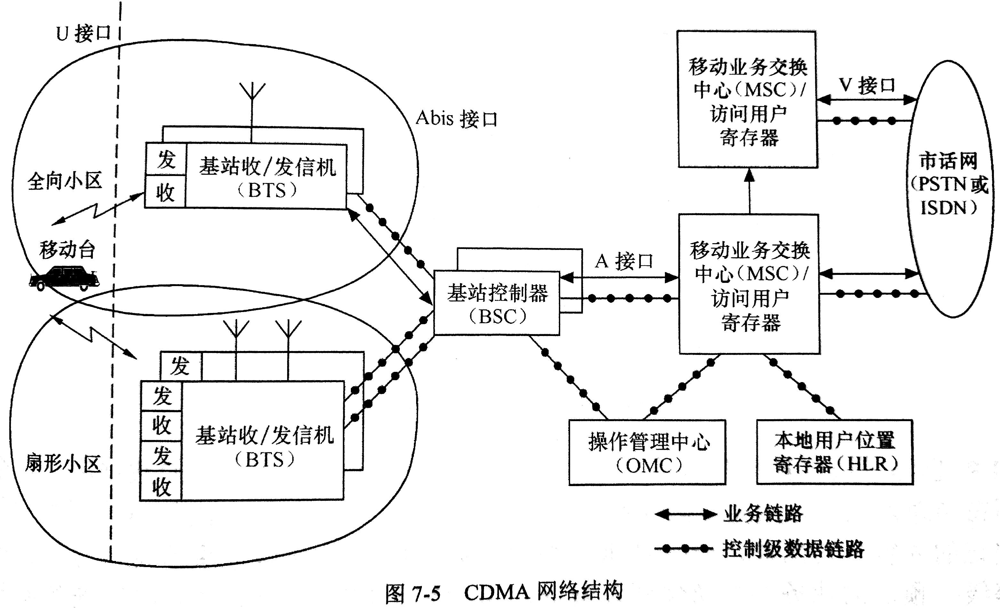

# CDMA

CDMA: Code-division multiple access

属于 3G时代 技术。

## 什么是扩展频谱通信？ 它是如何扩展信号带宽与解扩的？

扩频通信是一种信息传输方式，是码分多址的基础。

在发送端，采用扩频码进行调制，使信号所占的频带宽度远大于所传信息必须的带宽； 在接收端，采用相同的扩频码进行相关解调来解扩，以恢复原有信息。

## CDMA 系统有哪些基本特点？

* **系统容量大**
* **软容量**: 比如小区呼吸
* **话音质量高**
* **具有软切换功能**: 先接后断
* **保密性强**
* **多种形式的分集**: 时间、频率、空间
* **精确的功率控制**: 对抗远近效应
* **话音激活**: 不讲话时传输速率降低

## CDMA 基本特性包括哪些方面的内容？

* **工作频段**: 与GSM的频段不一样
* **信道数**
* **调制方式**: 基站QPSK； 移动台OQPSK
* **采用直接系列扩频\(DSSS\)**\(direct-sequence spread spectrum\)
* **语音编、解码**: CELP\(Code-excited linear prediction\), 码激励线性预测
* **基于GPS时间**
* **支持双模式移动台**: `AMPS(Advanced Mobile Phone System)模拟蜂窝系统` 和 `CDMA`

## CDMA 前向传输信道是怎样配置的？

**前向信道\(下行信道\)**: 基站发射，移动台接收

采用了`频分`、`伪随机码分`和`正交信号多址`相结合的方式，将可用的蜂窝频谱划分为1.23MHz带宽的`频率信道`，在一个频率信道上利用`沃尔什函数`对`各用户的信息`和`不同种类的信令信息`进行`扩频编码`形成`逻辑信道`。这些逻辑信道包括：

* **导频**信道：移动台利用`导频信道`作`相位定时`和`频率参考`以及在切换时用于`信号强度比较(功率控制测量)`，即移动台使用`导频信道`进行`相干解调`、`捕获`、`时间延迟追踪`、`功率控制测量`，并辅助进行切换。
* **同步**信道：使移动台确定`系统时间`和`基站导频偏置`。只有在完成同步过程后，移动台才能利用导频信号实现接收解调。同步信道中的信息包括`寻呼信道的数据速率`，相对系统时间的`基站导频伪随机序列的时间`等。
* **寻呼**信道：用来传送`系统开销信息`和`移动台特定消息`，以寻呼一个移动台。当移动台被呼时，基站就在寻呼信道上广播`移动台的识别码`，被呼的移动台收到识别码后，在`上行接入信道`上作出响应。
* **业务**信道：载有编码后的用户业务信息，这些业务信息的速率是可变的。

## 业务信道上包含哪些类型的控制消息？

* 呼叫控制
* 切换控制
* 前向功率控制
* 安全与鉴权控制

## CDMA 的网络结构是？

