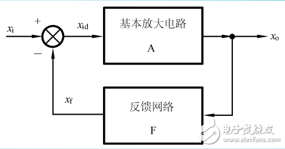

# Negative-feedback amplifier (负反馈放大电路)

___

反馈事实上就是靠硬件特性，用输出影响输入

这里的 picture 显示了 $$x_f$$ 如何夺取 $$$x_i$$ 的一部分资源，从而削弱`原输入`的过程

用公式表达就是：

$$X_i - x_f = x_id$$

$$x_{id}$$ 是我们最终的输入值，由此可见 $$x_f$$ 确实削弱了 $$x_id$$

___

#### 反馈类型判别

##### 1.

反馈支路上有电容 -> 直流

反馈支路上没有电容 -> 交流

##### 2.

令 $$U_o = 0$$, 反馈信号消失 -> 电压反馈

令 $$U_o = 0$$, 反馈信号存在 -> 电流反馈

##### 3.

反馈支路与`输入端`有节点 -> 并联反馈

反馈支路与`输入端`无节点 -> 串联反馈

#### 4.

$$X_i - x_f = x_id$$ , 负反馈

$$X_i + x_f = x_id$$ , 正反馈

___

#### 负反馈对放大电路的影响

1. `串联`负反馈 `增加` `输入阻抗`；`并联`负反馈 `减小` `输入阻抗`

2. `电流`负反馈 `增加` `输出阻抗`；`电压`负反馈 `减小` `输出阻抗`

3. `负反馈`能够增加`放大电路` `稳定性`
