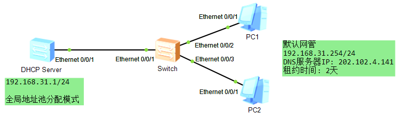
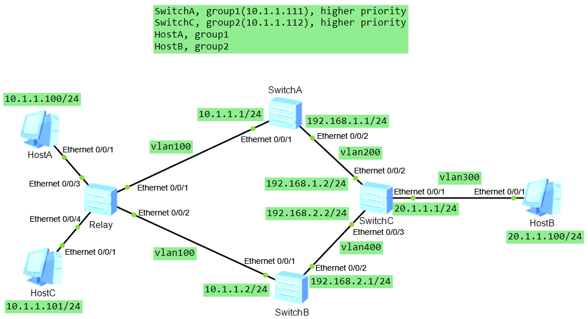
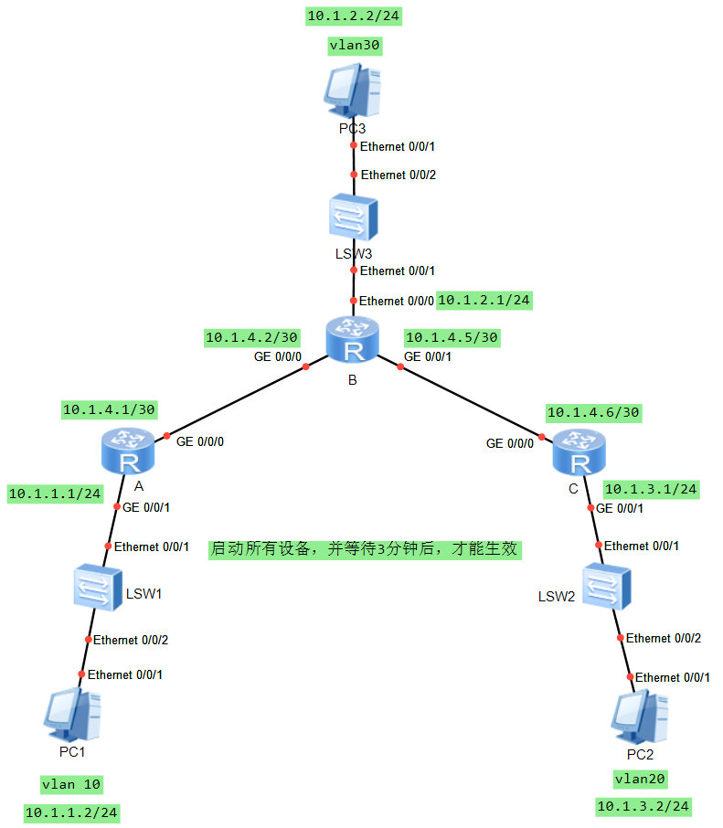
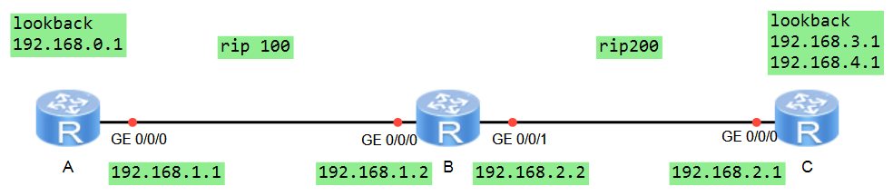
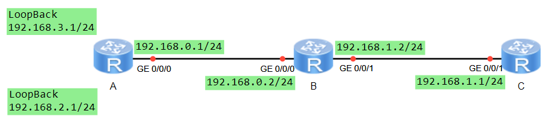
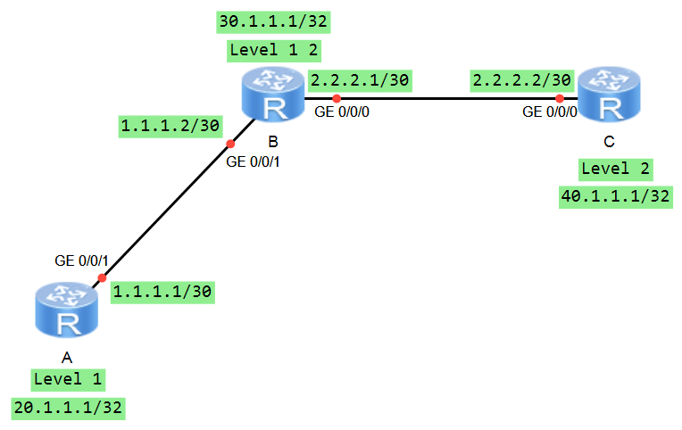
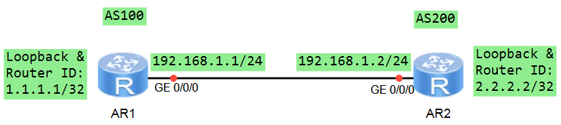
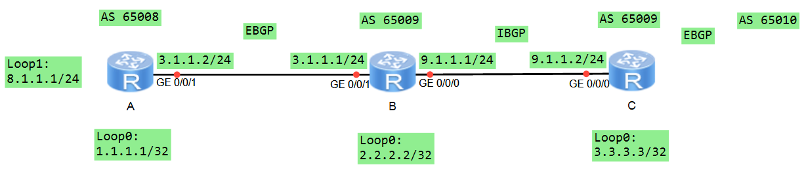
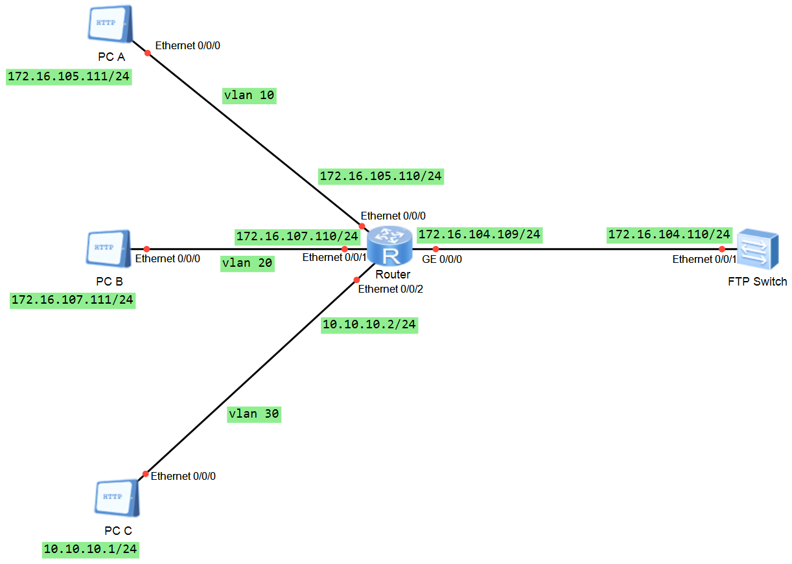

# Network Configuration Training

## 用路由器二层接口 配置 telnet

```text
telnet 192.168.0.6 6001

system-view
sysname yingshaoxo

vlan 10
quit

interface Ethernet0/0/1
port link-type access
port default vlan 10
quit

interface vlan 10
ip address 192.168.1.31 24
quit

aaa
local-user manager password cipher hi
local-user manager privilege level 15
local-user manager service-type telnet
quit

user-interface vty 0 4
authentication-mode aaa
quit
```

cipher 暗号

vty Virtual teletype

## 交换机使用 sftp

```text
telnet 192.168.0.6 6007

//let's assume the vlan10 at switch is 192.168.1.31
//start sftp at 192.168.1.32

tftp 192.168.1.32 put vrpcfg.zip

tftp 192.168.1.32 get vrpcfg.zip yingshaoxo.zip
```

## 端口属性设置

```text
telnet 192.168.0.6 6004

//Let's assume that we already have two switches connected by a line at each Ethernet0/0/1

display interface Ethernet 0/0/1
system-view
sysname yingshaoxo
interface Ethernet 0/0/1
undo negotiation auto
duplex half
speed 10

vlan 10
quit
interface Ethernet 0/0/1
port link-type access
port default vlan 10

interface vlan 10
//Let's assume another switch have an ip address 1.1.1.6
ip address 1.1.1.7 24

ping 1.1.1.6
```

## 端口隔离配置

```text
telnet 192.168.0.6 6004

// Three PC connect to one switch, Ethernet0/0/1, 2, 3

system-view
sysname yingshaoxo
port-isolate mode l2

interface Ethernet 0/0/1
port-isolate enable
port link-type access
quit

interface Ethernet 0/0/2
port-isolate enable
port link-type access
quit

//set three PC ip address directly from PC itself with 192.168.1.1, 2, 3
//now PC1 can't ping PC2 successfully
```

## 端口聚合

```text
telnet 192.168.0.6 6004
system-view
sysname SwitchA

//make sure to reset every Ethernet 0/0/*
reset saved-configuration
reboot

interface eth-trunk 1
//bridge protocol data units
bpdu enable 
mode lacp-static
quit

interface Ethernet 0/0/1
eth-trunk 1
quit

interface Ethernet 0/0/2
eth-trunk 1
quit

interface Ethernet 0/0/3
eth-trunk 1
quit

lacp priority 100

interface eth-trunk 1
max active-linknumber 2
quit

interface Ethernet 0/0/1
lacp priority 100
quit

interface Ethernet 0/0/2
lacp priority 100
quit

interface Ethernet 0/0/3
lacp priority 100
quit

display eth-trunk 1

interface eth-trunk 1
lacp preempt enable
lacp preempt delay 10

display eth-trunk 1

interface Ethernet 0/0/2
shutdown
quit

display eth-trunk 1

interface Ethernet 0/0/2
undo shutdown
quit

display eth-trunk 1
```

Aggregation 聚合

lacp Link Aggregation Control Protocol

preempt 抢占

MSTP的配置

```text
// for SwitchA
system-view
sysname SwitchA
stp mode stp

// for SwitchB
system-view
sysname SwitchB
stp mode stp

// for SwitchC
system-view
sysname SwitchC
stp mode stp

// for SwitchD
system-view
sysname SwitchD
stp mode stp

// A
stp root primary

// D
stp root secondary

// C
interface ethernet 0/0/1
stp cost 20000
quit

//B
interface ethernet 0/0/2
stp disable
quit

//C
interface ethernet 0/0/2
stp disable
quit

//A,B,C,D
stp enable

//A
interface ethernet 0/0/1
bpdu enable
quit
interface ethernet 0/0/2
bpdu enable
quit

//B
interface ethernet 0/0/1
bpdu enable
quit
interface ethernet 0/0/3
bpdu enable
quit

//C
interface ethernet 0/0/1
bpdu enable
quit
interface ethernet 0/0/3
bpdu enable
quit

//D
interface ethernet 0/0/1
bpdu enable
quit
interface ethernet 0/0/2
bpdu enable
quit
```

跨交换机 VLAN 的配置

```text
telnet 192.168.0.6 6004
system-view
sysname SwitchA

vlan 3
quit
interface ethernet 0/0/1
port link-type access 
port default vlan 3
quit

interface ethernet 0/0/2
port link-type trunk
port trunk allow-pass vlan 3

// SwitchB do the same thing
```

GVRP\(generic VLAN Registration Protocol\) 配置

```text
telnet 192.168.0.6 6005
system-view
sysname Boss

gvrp

interface ethernet 0/0/1
port link-type trunk
port trunk allow vlan all
bpdu enable
gvrp
quit

interface ethernet 0/0/2
port link-type trunk
port trunk allow vlan all
bpdu enable
gvrp
quit

display vlan
```

三层独臂路由器让下面不同的VLAN互通

```text
telnet 192.168.0.6 6003
system-view
sysname Boss

Interface GigabitEthernet 0/0/0.1
dot1q termination vid 100
ip address 10.31.10.1 255.255.255.0
arp broadcast enable
quit

Interface GigabitEthernet 0/0/0.2
dot1q termination vid 200
ip address 10.31.20.1 255.255.255.0
arp broadcast enable
quit

//PC1, 10.31.10.2
//PC2, 10.31.20.2
```

三层交换机的静态路由配置

```text
//B
system-view
vlan 20
quit
interface ethernet 0/0/3
port link-type access
port default vlan 20
quit
interface vlan 20
ip address 1.1.2.1 255.255.255.0
quit

vlan 40
quit
interface ethernet 0/0/1
port link-type trunk
port trunk allow-pass vlan all
quit
interface vlan 40
ip address 1.1.4.2 255.255.255.0
quit

vlan 50
quit
interface ethernet 0/0/2
port link-type trunk
port trunk allow-pass vlan all
quit
interface vlan 50
ip address 1.1.5.2 255.255.255.0
quit

//A
system-view
vlan 10
quit
interface ethernet 0/0/2
port link-type access
port default vlan 10
quit
interface vlan 10
ip address 1.1.1.1 255.255.255.0
quit

vlan 40
quit
interface ethernet 0/0/1
port link-type trunk
port trunk allow-pass vlan all
quit
interface vlan 40
ip address 1.1.4.1 255.255.255.0
quit

//C
system-view
vlan 30
quit
interface ethernet 0/0/2
port link-type access
port default vlan 30
quit
interface vlan 30
ip address 1.1.3.1 255.255.255.0
quit

vlan 50
quit
interface ethernet 0/0/1
port link-type trunk
port trunk allow-pass vlan all
quit
interface vlan 50
ip address 1.1.5.1 255.255.255.0
quit

//PC1: 1.1.1.2/24
//PC2: 1.1.2.2/24
//PC3: 1.1.3.2/24

// set routing table
// A
ip route-static 1.1.2.0 24 1.1.4.2
ip route-static 1.1.5.0 24 1.1.4.2
ip route-static 1.1.3.0 24 1.1.4.2

// B
ip route-static 1.1.1.0 24 1.1.4.1
ip route-static 1.1.3.0 24 1.1.5.1

// C
ip route-static 1.1.2.0 24 1.1.5.2
ip route-static 1.1.4.0 24 1.1.5.2
ip route-static 1.1.1.0 24 1.1.5.2

// 3 PC has to set gateway, for example, PC1, 1.1.1.1, 1.1.2.1, 1.1.3.1
```


按理来说，我们可以从这一系列的操作中学到很多东西。

1. PC1 到 SwitchA，设置了一个 access port untagged frame 通过贴上 pvid，变成了 vlan10 tagged frame
2. SwitchA 到 SwitchB，设置了两个 trunk port 在第一个端口，`vlan10 tagged frame`与`默认的pvid 1`不同，被直接发送；在第二个端口，`vlan10 tagged frame` 属于 `allowed vlan`，所以被接收
3. SwitchB 到 PC2，设置了一个 access port 把`vlan10 tagged frame`变成`untagged frame`，再发送给 PC2

DHCP\(Dynamic Host Configuration Protocol\) 配置



```text
//// DHCP server
system-view
dhcp enable

//set a ip pool, from 192.168.31.1 to 192.168.31.253
ip pool 1
network 192.168.31.0 mask 255.255.255.0
dns-list 202.102.4.141
gateway-list 192.168.31.254
lease day 2
quit

//make sure all frames to pc is untagged, all frames to DHCP server is tagged with vlan 10
vlan batch 10
interface Ethernet 0/0/1
port hybrid pvid vlan 10
port hybrid untagged vlan 10
quit

// the DHCP Server has to have an ip_address, so other host could reach it.
interface vlanif 10
ip address 192.168.31.1 24

// and we also have to allow/enable that dhcp protocol forwarding at the output port (here is a virtual LAN)
dhcp select global
```

VRRP\(Virtual Router Redundancy Protocol\) 配置 \(目的: 让各个Host通过IP互通，并且`屏蔽掉`底层`具体的硬件端口IP地址`，从而使`一个虚拟网关`对应`多个实体硬件线路`\)



**我没做出来，下面的代码大概是错的**

```text
//// A, B, C
system-view
undo stp enable
y

// set Host gateway
//hostA: 10.1.1.111
//hostC: 10.1.1.112
//hostB: 20.1.1.1

//// A
system-view
vlan batch 100 200
interface ethernet 0/0/1
port hybrid pvid vlan 100
port hybrid untagged vlan 100
quit

interface vlan 100
ip address 10.1.1.1 24
quit
interface vlan 200
ip address 192.168.1.1 24
quit

//// B
system-view
vlan batch 100 400
//interface ethernet 0/0/1
//port hybrid pvid vlan 100
//port hybrid untagged vlan 100

interface vlan 100
ip address 10.1.1.2 24
quit
interface vlan 400
ip address 192.168.2.1 24
quit

//// C
system-view
vlan batch 200 400 300
interface vlan 200
ip address 192.168.1.2 24
quit
interface vlan 400
ip address 192.168.2.2 24
quit
interface vlan 300
ip address 20.1.1.1 24
quit

//// A
// use ospf routing protocol to do this
system-view
ospf 1
area 0
network 10.1.1.0 0.0.0.255
network 192.168.1.0 0.0.0.255
quit
quit

//// B
system-view
ospf 1
area 0
network 10.1.1.0 0.0.0.255
network 192.168.2.0 0.0.0.255
quit
quit

//// C
system-view
ospf 1
area 0
network 192.168.1.0 0.0.0.255
network 192.168.2.0 0.0.0.255
network 20.1.1.0 0.0.0.255
quit
quit

//// set VRRP
// A
interface vlan 100
vrrp vrid 1 virtual-ip 10.1.1.111
vrrp vrid 1 priority 120
vrrp vrid 2 virtual-ip 10.1.1.112
vrrp vrid 2 priority 100
quit

// B
interface vlan 100
vrrp vrid 1 virtual-ip 10.1.1.111
vrrp vrid 1 priority 100
vrrp vrid 2 virtual-ip 10.1.1.112
vrrp vrid 2 priority 120
quit
```

静态路由的配置



```text
telnet 192.168.0.6 6005

// Switch B
vlan batch 30

interface Ethernet 0/0/2
port link-type access
port default vlan 30
quit

interface Ethernet 0/0/1
port hybrid pvid vlan 30
port hybrid untagged vlan 30
quit

// Router B
vlan batch 30

interface vlan 30
ip address 10.1.2.1 255.255.255.0
quit

interface Ethernet 0/0/0
port link-type access
port default vlan 30
quit

interface GigabitEthernet 0/0/0
ip address 10.1.4.2 255.255.255.252
quit

interface GigabitEthernet0/0/1
ip address 10.1.4.5 255.255.255.252
quit

ip route-static 10.1.1.0 255.255.255.0 10.1.4.1
ip route-static 10.1.3.0 255.255.255.0 10.1.4.6

// Switch A
vlan batch 10

interface Ethernet0/0/2
port link-type access
port default vlan 10
quit

interface Ethernet0/0/1
port hybrid pvid vlan 10
port hybrid untagged vlan 10
quit

// Router A
interface GigabitEthernet0/0/0
ip address 10.1.4.1 255.255.255.252 
quit

interface GigabitEthernet0/0/1
ip address 10.1.1.1 255.255.255.0 
quit

// Switch B
vlan batch 20

interface Ethernet0/0/2
port link-type access
port default vlan 20
quit

interface Ethernet0/0/1
port link-type trunk
port trunk pvid vlan 20
port trunk allow-pass vlan 20
quit

// Router C
interface GigabitEthernet0/0/0
ip address 10.1.4.6 255.255.255.252 
quit

interface GigabitEthernet0/0/1
ip address 10.1.3.1 255.255.255.0
quit

ip route-static 0.0.0.0 0.0.0.0 10.1.4.5
ip route-static 10.1.1.0 255.255.255.0 10.1.4.5
```

OSPF 路由协议基本配置

```text
telnet 192.168.0.6 6002

system-view

router id 2.2.2.2

interface GigabitEthernet 0/0/1
ip address 192.168.0.2 24
quit

vlan batch 20
interface vlan 20
ip address 192.168.2.1 24
quit

interface Ethernet 0/0/1
port link-type trunk
port trunk allow-pass vlan 20
quit

ospf 2
area 0.0.0.0
network 192.168.2.0 0.0.0.255
network 192.168.0.0 0.0.0.255
quit
quit
```

RIP 引入外部路由配置



```text
//// A
interface GigabitEthernet 0/0/0
ip address 192.168.1.1 24
quit

interface LoopBack1
ip address 192.168.0.1 24
quit

rip 100
network 192.168.0.0
network 192.168.1.0
quit

//// B
interface GigabitEthernet 0/0/0
ip address 192.168.1.2 24
quit

interface GigabitEthernet 0/0/1
ip address 192.168.2.2 24
quit

rip 100
network 192.168.1.0
quit
default-cost 3
import-route rip 200

rip 200
network 192.168.2.0
import-route rip 100
quit

//// C
interface GigabitEthernet 0/0/0
ip address 192.168.2.1 24
quit

interface LoopBack2
ip address 192.168.3.1 24
quit

interface LoopBack3
ip address 192.168.4.1 24
quit

rip 200
network 192.168.2.0
network 192.168.3.0
network 192.168.4.0
quit
```

OSPF 引入路由聚合功能



```text
//// A
system-view

interface LoopBack 1
ip address 192.168.3.1 255.255.255.0
quit
interface LoopBack 2
ip address 192.168.2.1 255.255.255.0
quit

router id 1.1.1.1
interface LoopBack 3
ip address 1.1.1.1 255.255.255.255
quit

interface GigabitEthernet 0/0/0
ip address 192.168.0.1 255.255.255.0
quit

ospf 2
asbr-summary 192.168.2.0 255.255.254.0
import-route direct
area 0.0.0.0
network 192.168.0.0 0.0.0.255
quit
quit

//// B
system-view

router id 2.2.2.2
interface LoopBack 0
ip address 2.2.2.2 255.255.255.255
quit

interface GigabitEthernet 0/0/0
ip address 192.168.0.2 255.255.255.0
quit

interface GigabitEthernet 0/0/1
ip address 192.168.1.2 255.255.255.0
quit

ospf 2
area 0.0.0.0
network 192.168.0.0 0.0.0.255
area 0.0.0.1
network 192.168.1.0 0.0.0.255
quit
quit

//// C
system-view

router id 3.3.3.3
interface LoopBack 0
ip address 3.3.3.3 255.255.255.255
quit

interface GigabitEthernet 0/0/1
ip address 192.168.1.1 255.255.255.0
quit

ospf 2
area 0.0.0.1
network 192.168.1.0 0.0.0.255
quit
quit
```

IS-IS 路由配置



```text
//// A
system-view

isis
network-entity 86.0001.0200.0100.1001.00
is-level level-1
quit

interface LoopBack 0
ip address 20.1.1.1 32
isis enable
quit

interface GigabitEthernet 0/0/1
ip address 1.1.1.1 30
isis enable
isis circuit-level level-1
quit

//// B
system-view

isis
network-entity 86.0001.0300.0100.1001.00
is-level level-1-2
quit

interface GigabitEthernet 0/0/1
ip address 1.1.1.2 30
isis enable
isis circuit-level level-1
quit

interface GigabitEthernet 0/0/0
ip address 2.2.2.1 30
isis enable
isis circuit-level level-2
quit

interface LoopBack 0
ip address 30.1.1.1 32
isis enable
quit

//// C
system-view

isis
network-entity 86.0002.0400.0100.1001.00
is-level level-2
quit

interface GigabitEthernet 0/0/0
ip address 2.2.2.2 30
isis enable
isis circuit-level level-2
quit

interface LoopBack 0
ip address 40.1.1.1 32
isis enable
quit
```

路由器间建立 EBGP 邻居



```text
// AR1
system-view

interface LoopBack 0
ip address 1.1.1.1 32
quit

interface GigabitEthernet 0/0/0
ip address 192.168.1.1 24
quit

bgp 100
router-id 1.1.1.1
peer 2.2.2.2 as-number 200
peer 2.2.2.2 connect-interface LoopBack0
peer 2.2.2.2 ebgp-max-hop 2
ip route-static 2.2.2.2 255.255.255.255 192.168.1.2

// AR2
system-view

interface LoopBack 0
ip address 2.2.2.2 32
quit

interface GigabitEthernet 0/0/0
ip address 192.168.1.2 24
quit

bgp 200
router-id 2.2.2.2
peer 1.1.1.1 as-number 100
peer 1.1.1.1 connect-interface LoopBack0
peer 1.1.1.1 ebgp-max-hop 2
ip route-static 1.1.1.1 255.255.255.255 192.168.1.1

// check, should have established
display bgp peer
```

BGP 基本配置



```text
// A
system-view
interface GigabitEthernet 0/0/1
ip address 3.1.1.2 24
quit

interface LoopBack 0
ip address 1.1.1.1 32
quit

interface LoopBack 1
ip address 8.1.1.1 24
quit

bgp 65008
router-id 1.1.1.1
peer 3.1.1.1 as-number 65009
//peer 1.1.1.1 connect-interface LoopBack0
network 8.1.1.1 24
quit

// B
system-view
interface GigabitEthernet 0/0/1
ip address 3.1.1.1 24
quit

interface LoopBack 0
ip address 2.2.2.2 32
quit

interface GigabitEthernet 0/0/0
ip address 9.1.1.1 24
quit

bgp 65009
router-id 2.2.2.2
peer 3.1.1.2 as-number 65008
peer 3.3.3.3 as-number 65009
peer 3.3.3.3 connect-interface LoopBack0
import-route direct
quit

ospf 1
area 0
network 2.2.2.2 0.0.0.0
network 9.1.1.1 0.0.0.255
quit
quit

// C
system-view
interface GigabitEthernet 0/0/0
ip address 9.1.1.2 24
quit

interface LoopBack 0
ip address 3.3.3.3 32
quit

bgp 65009
router-id 3.3.3.3
peer 2.2.2.2 as-number 65009
peer 2.2.2.2 connect-interface LoopBack0
quit

ospf 1
area 0
network 3.3.3.3 0.0.0.0
network 9.1.1.0 0.0.0.255
quit
quit

// B
bgp 65009
router-id 2.2.2.2
peer 3.1.1.2 as-number 65008
peer 3.3.3.3 as-number 65009
peer 3.3.3.3 connect-interface LoopBack0
import-route direct
quit
```

ACL 基本配置



```text
// Router
system-view

interface GigabitEthernet 0/0/0
ip address 172.16.104.109 24
quit

vlan batch 10 20 30

interface Ethernet 0/0/0
port link-type access
port default vlan 10
quit

interface Ethernet 0/0/1
port link-type access
port default vlan 20
quit

interface Ethernet 0/0/2
port link-type access
port default vlan 30
quit

interface vlan 10
ip address 172.16.105.110 24
quit

interface vlan 20
ip address 172.16.107.110 24
quit

interface vlan 30
ip address 10.10.10.2 24
quit

// PC A, B, C
A: 172.16.105.111 24, gateway is 172.16.105.110
B: 172.16.107.111 24, gateway is 172.16.107.110
C: 10.10.10.1 24, gateway is 10.10.10.2

// FTP Switch
system-view

vlan batch 40
interface vlan 40
ip address 172.16.104.110 24
quit
interface Ethernet 0/0/1
port link-type hybrid
port hybrid pvid vlan 40
port hybrid untagged vlan 40
quit

ip route-static 172.16.105.0 24 172.16.104.109
ip route-static 172.16.107.0 24 172.16.104.109
ip route-static 10.10.10.0 24 172.16.104.109

ftp server enable
aaa
local-user qq password simple 1234
local-user qq ftp-directory flash
local-user qq service-type ftp
local-user qq privilege level 15
quit
```

```text
// Router
system-view

interface GigabitEthernet 0/0/0
ip address 172.16.104.109 24
quit

vlan batch 10 20 30

interface Ethernet 0/0/0
port link-type access
port default vlan 10
quit

interface Ethernet 0/0/1
port link-type access
port default vlan 20
quit

interface Ethernet 0/0/2
port link-type access
port default vlan 30
quit

interface vlan 10
ip address 172.16.105.110 24
quit

interface vlan 20
ip address 172.16.107.110 24
quit

interface vlan 30
ip address 10.10.10.2 24
quit

// PC A, B, C
A: 172.16.105.111 24, gateway is 172.16.105.110
B: 172.16.107.111 24, gateway is 172.16.107.110
C: 10.10.10.1 24, gateway is 10.10.10.2

// FTP Switch
system-view

vlan batch 40
interface vlan 40
ip address 172.16.104.110 24
quit
interface Ethernet 0/0/1
port link-type hybrid
port hybrid pvid vlan 40
port hybrid untagged vlan 40
quit

ip route-static 172.16.105.0 24 172.16.104.109
ip route-static 172.16.107.0 24 172.16.104.109
ip route-static 10.10.10.0 24 172.16.104.109

ftp server enable
aaa
local-user qq password simple 1234
local-user qq ftp-directory flash
local-user qq service-type ftp
local-user qq privilege level 15
quit
```

```text
// Router
system-view

interface GigabitEthernet 0/0/0
ip address 172.16.104.109 24
quit

vlan batch 10 20 30

interface Ethernet 0/0/0
port link-type access
port default vlan 10
quit

interface Ethernet 0/0/1
port link-type access
port default vlan 20
quit

interface Ethernet 0/0/2
port link-type access
port default vlan 30
quit

interface vlan 10
ip address 172.16.105.110 24
quit

interface vlan 20
ip address 172.16.107.110 24
quit

interface vlan 30
ip address 10.10.10.2 24
quit

// PC A, B, C
A: 172.16.105.111 24, gateway is 172.16.105.110
B: 172.16.107.111 24, gateway is 172.16.107.110
C: 10.10.10.1 24, gateway is 10.10.10.2

// FTP Switch
system-view

vlan batch 40
interface vlan 40
ip address 172.16.104.110 24
quit
interface Ethernet 0/0/1
port link-type hybrid
port hybrid pvid vlan 40
port hybrid untagged vlan 40
quit

ip route-static 172.16.105.0 24 172.16.104.109
ip route-static 172.16.107.0 24 172.16.104.109
ip route-static 10.10.10.0 24 172.16.104.109

ftp server enable
aaa
local-user qq password simple 1234
local-user qq ftp-directory flash
local-user qq service-type ftp
local-user qq privilege level 15
quit
```

```text
// Router
system-view

interface GigabitEthernet 0/0/0
ip address 172.16.104.109 24
quit

vlan batch 10 20 30

interface Ethernet 0/0/0
port link-type access
port default vlan 10
quit

interface Ethernet 0/0/1
port link-type access
port default vlan 20
quit

interface Ethernet 0/0/2
port link-type access
port default vlan 30
quit

interface vlan 10
ip address 172.16.105.110 24
quit

interface vlan 20
ip address 172.16.107.110 24
quit

interface vlan 30
ip address 10.10.10.2 24
quit

// PC A, B, C
A: 172.16.105.111 24, gateway is 172.16.105.110
B: 172.16.107.111 24, gateway is 172.16.107.110
C: 10.10.10.1 24, gateway is 10.10.10.2

// FTP Switch
system-view

vlan batch 40
interface vlan 40
ip address 172.16.104.110 24
quit
interface Ethernet 0/0/1
port link-type hybrid
port hybrid pvid vlan 40
port hybrid untagged vlan 40
quit

ip route-static 172.16.105.0 24 172.16.104.109
ip route-static 172.16.107.0 24 172.16.104.109
ip route-static 10.10.10.0 24 172.16.104.109

ftp server enable
aaa
local-user qq password simple 1234
local-user qq ftp-directory flash
local-user qq service-type ftp
local-user qq privilege level 15
quit
```

```text
// Router
system-view

interface GigabitEthernet 0/0/0
ip address 172.16.104.109 24
quit

vlan batch 10 20 30

interface Ethernet 0/0/0
port link-type access
port default vlan 10
quit

interface Ethernet 0/0/1
port link-type access
port default vlan 20
quit

interface Ethernet 0/0/2
port link-type access
port default vlan 30
quit

interface vlan 10
ip address 172.16.105.110 24
quit

interface vlan 20
ip address 172.16.107.110 24
quit

interface vlan 30
ip address 10.10.10.2 24
quit

// PC A, B, C
A: 172.16.105.111 24, gateway is 172.16.105.110
B: 172.16.107.111 24, gateway is 172.16.107.110
C: 10.10.10.1 24, gateway is 10.10.10.2

// FTP Switch
system-view

vlan batch 40
interface vlan 40
ip address 172.16.104.110 24
quit
interface Ethernet 0/0/1
port link-type hybrid
port hybrid pvid vlan 40
port hybrid untagged vlan 40
quit

ip route-static 172.16.105.0 24 172.16.104.109
ip route-static 172.16.107.0 24 172.16.104.109
ip route-static 10.10.10.0 24 172.16.104.109

ftp server enable
aaa
local-user qq password simple 1234
local-user qq ftp-directory flash
local-user qq service-type ftp
local-user qq privilege level 15
quit
```

```text
// Router
system-view

interface GigabitEthernet 0/0/0
ip address 172.16.104.109 24
quit

vlan batch 10 20 30

interface Ethernet 0/0/0
port link-type access
port default vlan 10
quit

interface Ethernet 0/0/1
port link-type access
port default vlan 20
quit

interface Ethernet 0/0/2
port link-type access
port default vlan 30
quit

interface vlan 10
ip address 172.16.105.110 24
quit

interface vlan 20
ip address 172.16.107.110 24
quit

interface vlan 30
ip address 10.10.10.2 24
quit

// PC A, B, C
A: 172.16.105.111 24, gateway is 172.16.105.110
B: 172.16.107.111 24, gateway is 172.16.107.110
C: 10.10.10.1 24, gateway is 10.10.10.2

// FTP Switch
system-view

vlan batch 40
interface vlan 40
ip address 172.16.104.110 24
quit
interface Ethernet 0/0/1
port link-type hybrid
port hybrid pvid vlan 40
port hybrid untagged vlan 40
quit

ip route-static 172.16.105.0 24 172.16.104.109
ip route-static 172.16.107.0 24 172.16.104.109
ip route-static 10.10.10.0 24 172.16.104.109

ftp server enable
aaa
local-user qq password simple 1234
local-user qq ftp-directory flash
local-user qq service-type ftp
local-user qq privilege level 15
quit
```

```text
// Router
system-view

interface GigabitEthernet 0/0/0
ip address 172.16.104.109 24
quit

vlan batch 10 20 30

interface Ethernet 0/0/0
port link-type access
port default vlan 10
quit

interface Ethernet 0/0/1
port link-type access
port default vlan 20
quit

interface Ethernet 0/0/2
port link-type access
port default vlan 30
quit

interface vlan 10
ip address 172.16.105.110 24
quit

interface vlan 20
ip address 172.16.107.110 24
quit

interface vlan 30
ip address 10.10.10.2 24
quit

// PC A, B, C
A: 172.16.105.111 24, gateway is 172.16.105.110
B: 172.16.107.111 24, gateway is 172.16.107.110
C: 10.10.10.1 24, gateway is 10.10.10.2

// FTP Switch
system-view

vlan batch 40
interface vlan 40
ip address 172.16.104.110 24
quit
interface Ethernet 0/0/1
port link-type hybrid
port hybrid pvid vlan 40
port hybrid untagged vlan 40
quit

ip route-static 172.16.105.0 24 172.16.104.109
ip route-static 172.16.107.0 24 172.16.104.109
ip route-static 10.10.10.0 24 172.16.104.109

ftp server enable
aaa
local-user qq password simple 1234
local-user qq ftp-directory flash
local-user qq service-type ftp
local-user qq privilege level 15
quit
```

```text
// Router
system-view

interface GigabitEthernet 0/0/0
ip address 172.16.104.109 24
quit

vlan batch 10 20 30

interface Ethernet 0/0/0
port link-type access
port default vlan 10
quit

interface Ethernet 0/0/1
port link-type access
port default vlan 20
quit

interface Ethernet 0/0/2
port link-type access
port default vlan 30
quit

interface vlan 10
ip address 172.16.105.110 24
quit

interface vlan 20
ip address 172.16.107.110 24
quit

interface vlan 30
ip address 10.10.10.2 24
quit

// PC A, B, C
A: 172.16.105.111 24, gateway is 172.16.105.110
B: 172.16.107.111 24, gateway is 172.16.107.110
C: 10.10.10.1 24, gateway is 10.10.10.2

// FTP Switch
system-view

vlan batch 40
interface vlan 40
ip address 172.16.104.110 24
quit
interface Ethernet 0/0/1
port link-type hybrid
port hybrid pvid vlan 40
port hybrid untagged vlan 40
quit

ip route-static 172.16.105.0 24 172.16.104.109
ip route-static 172.16.107.0 24 172.16.104.109
ip route-static 10.10.10.0 24 172.16.104.109

ftp server enable
aaa
local-user qq password simple 1234
local-user qq ftp-directory flash
local-user qq service-type ftp
local-user qq privilege level 15
quit
```

```text
// Router
system-view

interface GigabitEthernet 0/0/0
ip address 172.16.104.109 24
quit

vlan batch 10 20 30

interface Ethernet 0/0/0
port link-type access
port default vlan 10
quit

interface Ethernet 0/0/1
port link-type access
port default vlan 20
quit

interface Ethernet 0/0/2
port link-type access
port default vlan 30
quit

interface vlan 10
ip address 172.16.105.110 24
quit

interface vlan 20
ip address 172.16.107.110 24
quit

interface vlan 30
ip address 10.10.10.2 24
quit

// PC A, B, C
A: 172.16.105.111 24, gateway is 172.16.105.110
B: 172.16.107.111 24, gateway is 172.16.107.110
C: 10.10.10.1 24, gateway is 10.10.10.2

// FTP Switch
system-view

vlan batch 40
interface vlan 40
ip address 172.16.104.110 24
quit
interface Ethernet 0/0/1
port link-type hybrid
port hybrid pvid vlan 40
port hybrid untagged vlan 40
quit

ip route-static 172.16.105.0 24 172.16.104.109
ip route-static 172.16.107.0 24 172.16.104.109
ip route-static 10.10.10.0 24 172.16.104.109

ftp server enable
aaa
local-user qq password simple 1234
local-user qq ftp-directory flash
local-user qq service-type ftp
local-user qq privilege level 15
quit
```

```text
// Router
system-view

interface GigabitEthernet 0/0/0
ip address 172.16.104.109 24
quit

vlan batch 10 20 30

interface Ethernet 0/0/0
port link-type access
port default vlan 10
quit

interface Ethernet 0/0/1
port link-type access
port default vlan 20
quit

interface Ethernet 0/0/2
port link-type access
port default vlan 30
quit

interface vlan 10
ip address 172.16.105.110 24
quit

interface vlan 20
ip address 172.16.107.110 24
quit

interface vlan 30
ip address 10.10.10.2 24
quit

// PC A, B, C
A: 172.16.105.111 24, gateway is 172.16.105.110
B: 172.16.107.111 24, gateway is 172.16.107.110
C: 10.10.10.1 24, gateway is 10.10.10.2

// FTP Switch
system-view

vlan batch 40
interface vlan 40
ip address 172.16.104.110 24
quit
interface Ethernet 0/0/1
port link-type hybrid
port hybrid pvid vlan 40
port hybrid untagged vlan 40
quit

ip route-static 172.16.105.0 24 172.16.104.109
ip route-static 172.16.107.0 24 172.16.104.109
ip route-static 10.10.10.0 24 172.16.104.109

ftp server enable
aaa
local-user qq password simple 1234
local-user qq ftp-directory flash
local-user qq service-type ftp
local-user qq privilege level 15
quit
```

```text
// Router
system-view

interface GigabitEthernet 0/0/0
ip address 172.16.104.109 24
quit

vlan batch 10 20 30

interface Ethernet 0/0/0
port link-type access
port default vlan 10
quit

interface Ethernet 0/0/1
port link-type access
port default vlan 20
quit

interface Ethernet 0/0/2
port link-type access
port default vlan 30
quit

interface vlan 10
ip address 172.16.105.110 24
quit

interface vlan 20
ip address 172.16.107.110 24
quit

interface vlan 30
ip address 10.10.10.2 24
quit

// PC A, B, C
A: 172.16.105.111 24, gateway is 172.16.105.110
B: 172.16.107.111 24, gateway is 172.16.107.110
C: 10.10.10.1 24, gateway is 10.10.10.2

// FTP Switch
system-view

vlan batch 40
interface vlan 40
ip address 172.16.104.110 24
quit
interface Ethernet 0/0/1
port link-type hybrid
port hybrid pvid vlan 40
port hybrid untagged vlan 40
quit

ip route-static 172.16.105.0 24 172.16.104.109
ip route-static 172.16.107.0 24 172.16.104.109
ip route-static 10.10.10.0 24 172.16.104.109

ftp server enable
aaa
local-user qq password simple 1234
local-user qq ftp-directory flash
local-user qq service-type ftp
local-user qq privilege level 15
quit
```

```text
// Router
system-view

interface GigabitEthernet 0/0/0
ip address 172.16.104.109 24
quit

vlan batch 10 20 30

interface Ethernet 0/0/0
port link-type access
port default vlan 10
quit

interface Ethernet 0/0/1
port link-type access
port default vlan 20
quit

interface Ethernet 0/0/2
port link-type access
port default vlan 30
quit

interface vlan 10
ip address 172.16.105.110 24
quit

interface vlan 20
ip address 172.16.107.110 24
quit

interface vlan 30
ip address 10.10.10.2 24
quit

// PC A, B, C
A: 172.16.105.111 24, gateway is 172.16.105.110
B: 172.16.107.111 24, gateway is 172.16.107.110
C: 10.10.10.1 24, gateway is 10.10.10.2

// FTP Switch
system-view

vlan batch 40
interface vlan 40
ip address 172.16.104.110 24
quit
interface Ethernet 0/0/1
port link-type hybrid
port hybrid pvid vlan 40
port hybrid untagged vlan 40
quit

ip route-static 172.16.105.0 24 172.16.104.109
ip route-static 172.16.107.0 24 172.16.104.109
ip route-static 10.10.10.0 24 172.16.104.109

ftp server enable
aaa
local-user qq password simple 1234
local-user qq ftp-directory flash
local-user qq service-type ftp
local-user qq privilege level 15
quit
```

