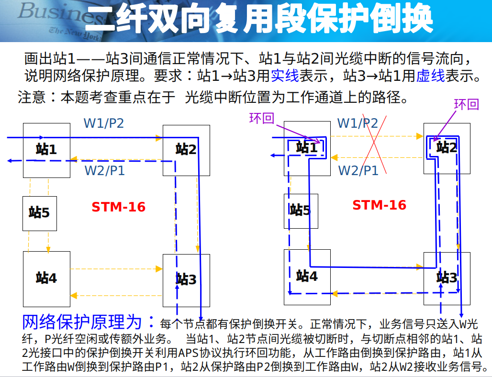
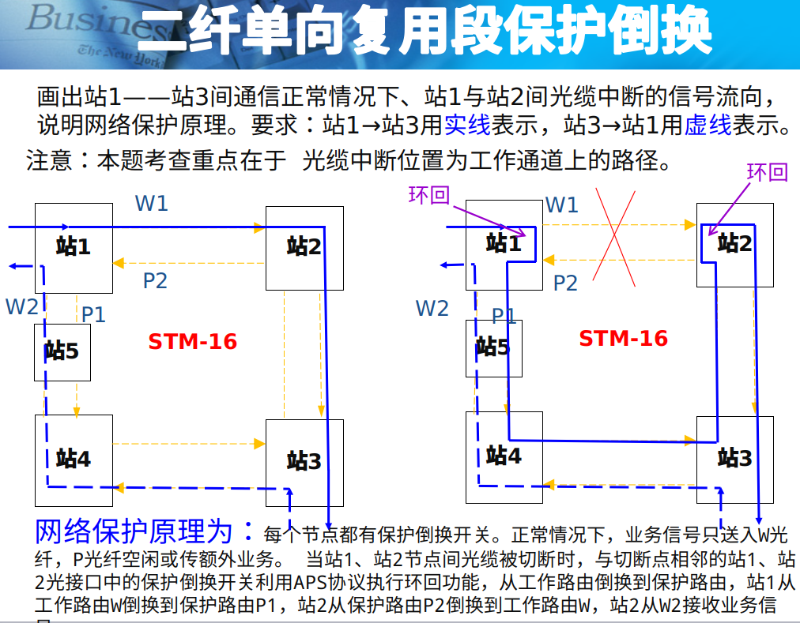
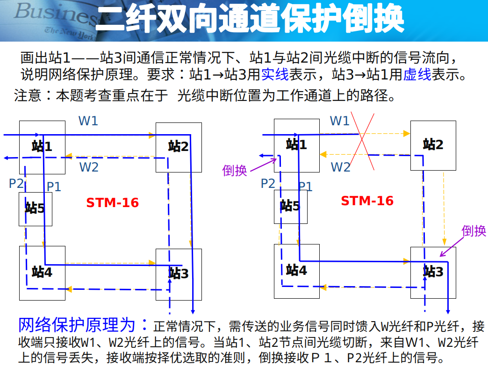
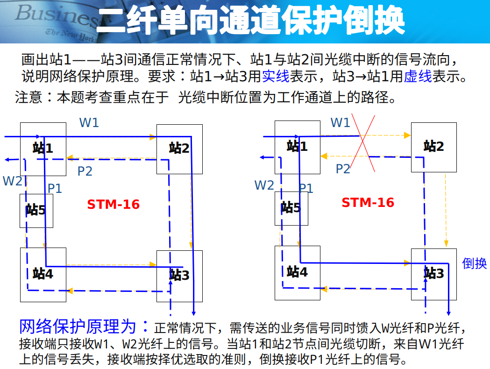

# SDH protection

> ODF = Optical Distribution Frame = 光纤配线架

## What?

`1+1`保护方式原理为：正常情况下，工作路由和保护路由同时传送业务信号，但接收端仅从工作路由选收业务信号；工作路由故障时，接收端倒换到保护路由选收业务信号。

`1:1`保护方式原理为：正常情况下，工作路由传送主业务信号，保护路由传送优先级低的额外业务。工作路由故障时，保护路由传送主业务信号。

## 保护

### 二纤双向复用段保护倒换

### 二纤单向复用段保护倒换

### 二纤双向通道保护倒换

### 二纤单向通道保护倒换

## 维护

### 分类

* 突发性维护
* 日常例行维护
* 周期性维护： 比如每月至少清扫风扇2次

### 误码率

误码秒比\(BBER, Background Block Error Ratio\): 误码率 &gt; $$1 \times 10^{-6}$$

严重误码秒比\(SESR, severely errored second ratio\): 误码率 &gt; $$1 \times 10^{-3}$$

> SESR最严格，BBER最松

