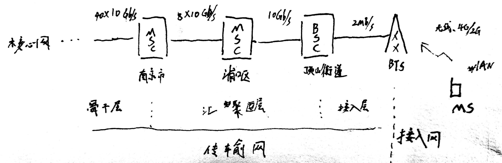

# Prepare

光纤\(Optical Fiber\)

波譜: 167THz ~ 375THz \($$1.67 \times 10^{14} \sim 3.75 \times 10^{14} Hz$$\)

波长: 0.8 ~ 1.8 $$\mu m$$

属于红外波段，不可见

## 光纤通信的优缺点

_优点：_

1. 频带宽、通信容量大
2. 损耗低，传输距离远
3. 抗电磁干扰、传输质量高
4. 光泄露小，保密性好
5. 重量轻，体积小
6. 原材料丰富 \(二氧化硅$$SiO_2$$\)

_缺点：_

1. 质地脆，机械强度差。
2. 光纤的切断和接续需要一定的工具、设备和技术。
3. 分路、耦合不灵活。
4. 光纤光缆的弯曲半径不能过小（&gt;20cm）

According to what my teacher says, this course is about the 'line' between devices.

