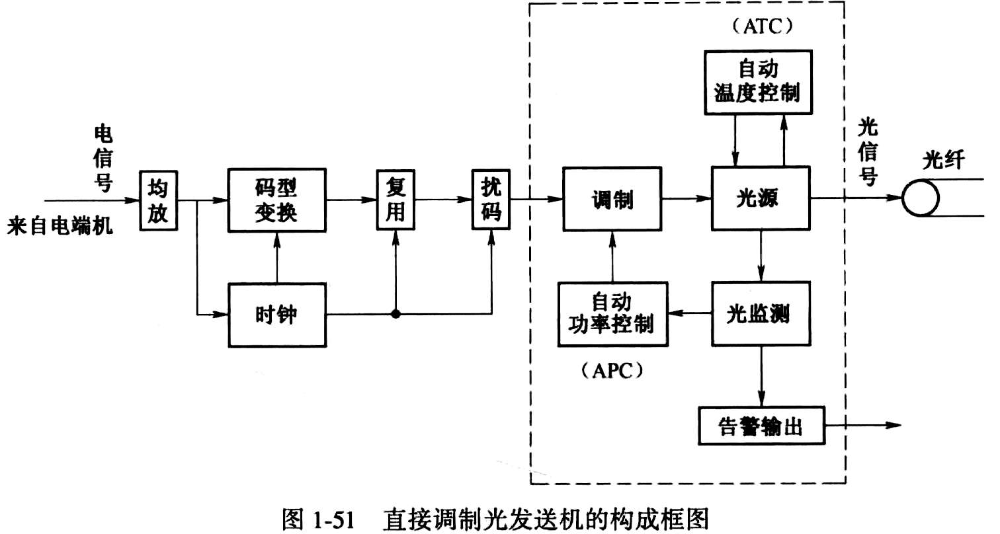

# Optical transmitter Test

## 一、光纤系统传输的码型

### 1. 对于`电接口`

#### 对于 PCM

**Ｅ1**: 2 Ｍbit/s, HDB3

**Ｅ2**: 8 Mbit/s, HDB3

**Ｅ3**: 34 Mbit/s, HDB3

**Ｅ4**: 139 Mbit/s, CMI

> E1指`一次集群`， 以此类推

#### 对于 Ethernet

**Eth\(Ethernet\)**: 10 Mbit/s，曼彻斯特编码\(Manchester Encoding\)

**FE\(Fast\_Ethernet\)**: 100 Mbit/s，曼彻斯特编码\(Manchester Encoding\)

**GE\(Gigabit\_Ethernet\)**: 1000 Mbit/s，曼彻斯特编码\(Manchester Encoding\)

### 2. 对于`光接口`

#### For SDH\(Synchronous optical networking\)

**STM-1**： 155 Ｍb/s, NRZ encoding

**STM-4**： 622 Ｍb/s, NRZ encoding

**STM-16**： 2488 Ｍb/s, NRZ encoding

**STM-64**： 9953 Ｍb/s, NRZ encoding

> STM: Synchronous Transport Module

#### For Ethernet

**Eth\(Ethernet\)**: 10 Mbit/s，mBnB

**FE\(Fast\_Ethernet\)**: 100 Mbit/s，mBnB

**GE\(Gigabit\_Ethernet\)**: 1000 Mbit/s，mBnB

> mBnB take m bits of the original data and encode them into n bits

## 二、光发送机的工作原理 \(电进光出\)

假设上面的图，左边是Ａ端，右边是Ｂ端

复用时，B端的接口速率一定 &gt; A端的接口速率

> 复用: 左边 多线进， 右边 单线出

APC: Automate Power Control

### 调制

#### 直接调制

* 调制简单、损耗小，成本低
* 啁啾\(chirp\)现象: `发射激光的波长`随着`调制电流的变化`而变化
* 用于速率 2.5 Gbit/s 以下系统

#### 间接调制

* 调制复杂，损耗大
* 无啁啾\(chirp\)现象
* 用于速率 2.5 Gbit/s 以上系统

## 三、光发送机性能指标

### 平均发送功率

01等概率，即正常工作时的发送功率

> 01等概率: 010 =&gt; 01 10 01

$$P_T = 10 \cdot \lg(\frac{P}{1mW})$$

单位是 dBm

### 消光比

$$\frac{\text{发送全1时的光功率}}{\text{发送全0时的光功率}}$$

$$\text{extinction ratio} = 10 \cdot (\frac{P_{11}}{P_{00}})$$ ，此时的P，单位是mw

$$\text{extinction ratio} = 3 + P_T - P_{00}$$ ，此时的P，单位是dBm

