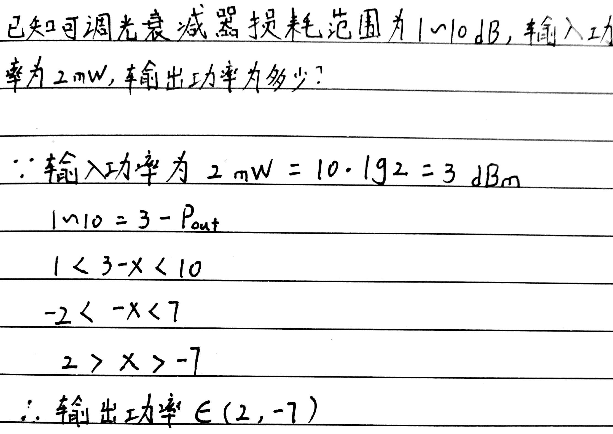

# Passive Optical Devices

让我们先来了解一下什么是db \(因为后面要大量用到它，如果不知道它是什么东西，对于程序员来讲，会睡不着覺的\)

中文: dB是一个比值，是一个数值，是一个纯计数方法，没有任何单位标注。

The `decibel (symbol: dB)` is a unit of measurement used to express the ratio of one value of a power or field quantity to another on a logarithmic scale, the logarithmic quantity being called the `power level` or `field level`, respectively.

It can be used to express a change in value \(e.g., +1 dB or −1 dB\) or an absolute value.

In the latter case, it expresses the ratio of a value to a fixed reference value; when used in this way, a suffix that indicates the reference value is often appended to the decibel symbol.

For example, if the reference value is 1 volt, then the suffix is "V" \(e.g., "20 dBV"\), and if the reference value is one milliwatt, then the suffix is "m" \(e.g., "20 dBm"\)

看起来是一种数值的表示方法，用来表示相对值。比如2dB与1dB，表示: 2dB的实际功率 是 1dB实际功率 的2倍。

功率 = Power

## 无\(电\)源光器件 \(Passive Optical Device\)

### 1. 光纤连接器 \(optical fiber connector\): 接头

### 2. 光衰减器 \(optical attenuator\): 用来减少光功率，单位`dB`。该器件类似电路里的电阻。

* 螺丝，顺时针“紧”，逆时针“松”
* 所有接受器件都有接受范围
* 近距离传输，衰减可近似于0
* `光发射机`与`光接收机`的功率并不一样，发射机比较大，接收机比较小，所以要用`衰减器`对发射信号进行处理，让它变小
* 假设$$发射端功率=P_1$$，$$接收端功率=P_2 \sim P_3$$，那么夹在中间的$$光衰减器的损耗 = (P_1 - P_2) \sim (P_1 - P_3)$$

### 3. 光耦合器 \(optical couplers\): 同一波长，分光 或 合光

* 平均分光
* $$1:2^n$$的分光器，光功率`下降`$$3 \times N\ dB$$
* $$2^n:1$$的分光器，光功率`增益(上升)`$$3 \times N\ dB$$
* 功率 -&gt; dB: $$10 \cdot \lg(\frac{功率\ mw}{1\ mw})$$
* $$1\ mw = 0\ dBm$$

### 4. 波分复用器 \(optical fiber wavelength division multiplexer\): 不同波长的分离与合并

### 5. 波长转换器 \(optical transponder unit\): 波长转换，如 1310 -&gt; 1550

### 6. 光学隔离器 \(optical isolator\): 隔离反向反射光

### 7. 光环形器 \(optical circulator\): 转发\(重新发射\)反向反射光； 换一条路再发

### 8. 光开关\(optical switch\): 通 与 断

## 测光衰减器

### 理论上:

光源\(optical source\) --- 光衰减器 --- 光功率计\(power meter\)

> 光源器上的读数不可靠，所以

### 实际上:

光源 --- 光功率计\(把它的`读数`看作`实际光源功率`\)\($$P_1$$\) --- 光衰减器 --- 光功率计\($$P_2$$\)

* $$dBm = 毫瓦分贝$$
* $$衰减 = P_1 - P_2$$

> 如果把`衰减器`换为`光纤`。设两头为A、B端，你需要把 A 到 B 测一遍，B 到 A 再测一遍，取平均值。\(我也不知道为什么光纤会有这个特性\)

说了一大堆，还是不知道它是什么意思？ Let's continue!

* $$dBm$$ 与 $$mW$$ 都是光功率的单位，但由于光功率的数值太大，不容易让人看出相对关系，所以人们使用$$dBm$$
* $$dBm = 10 \times \lg(P)$$ ， $$P$$ 表示功率\(power\)，$$\lg$$ 指以10为底的 $$\log$$

如此一来，如果你知道了光纤两端\(如A、B\)的具体功率值，你就可以直观地用$$dBm$$单位看出`两端之间的差异(是增加、增益还是减少、衰减)`

$$
\begin{align*}
dB &= 10 \times \lg(\frac{P_1}{P_2})
\\ \\
&= (10 \times \lg(P_1)) - (10 \times \lg(P_2))
\\ \\
&= dBm - dBm
\end{align*}
$$

$$dB$$ 这个由“减法”得到的值，足以让我们看出信号是`增加`还是`减少了`

## Question and Answers

