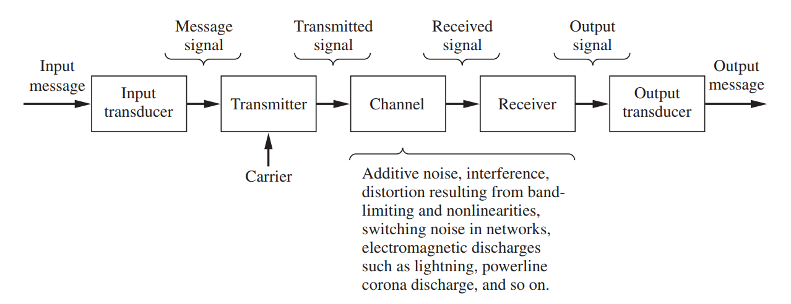
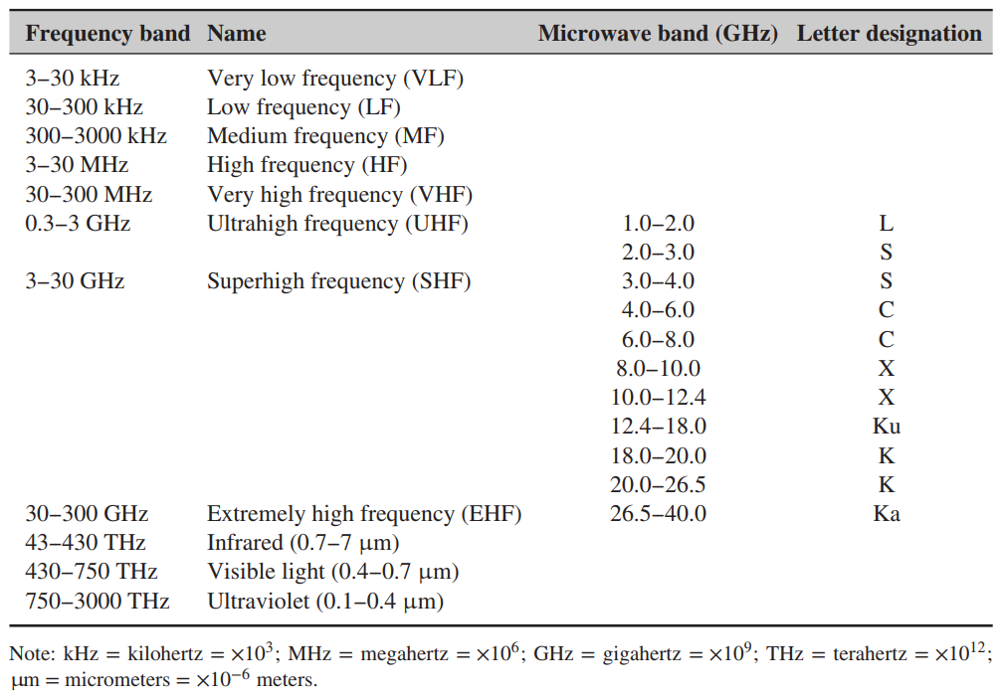
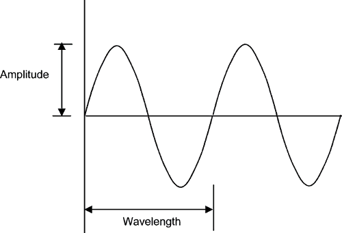
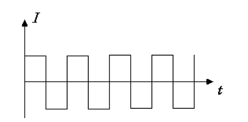

## The diagram of a communication system

___

## Frequency Bands with Designations

___

### There are two kinds of communication by 传输信号的不同: `模拟电子` 和 `数字电子` 

从我的角度看，

`模电` is kind of like 大自然中的信号，波形类似 `sine`， 可无限细分、采集（因为人的认识基于对比，而对比是无穷无尽的）

`数电` 是经过人处理过的更精确的信号表示，它通过高与低的变化传输 `方波` (高电平为 1, 低电平为 0)

___

### 无聊的表达式 与 计算

信息速率(传信率): $$R_b$$ or $$Rate_{bit}$$
> a small piece, part, or quantity of something.

码元速率(传码率): $$R_B$$ or $$Rate_{baud}$$
> a unit of transmission speed equal to the number of times a signal changes state per second.

$$R_b = R_B \cdot log_2{M}$$ , (M 为`几进制系统`的`几`)

$$T = \frac{1}{R_B}$$ , (T 为`码元宽度`)