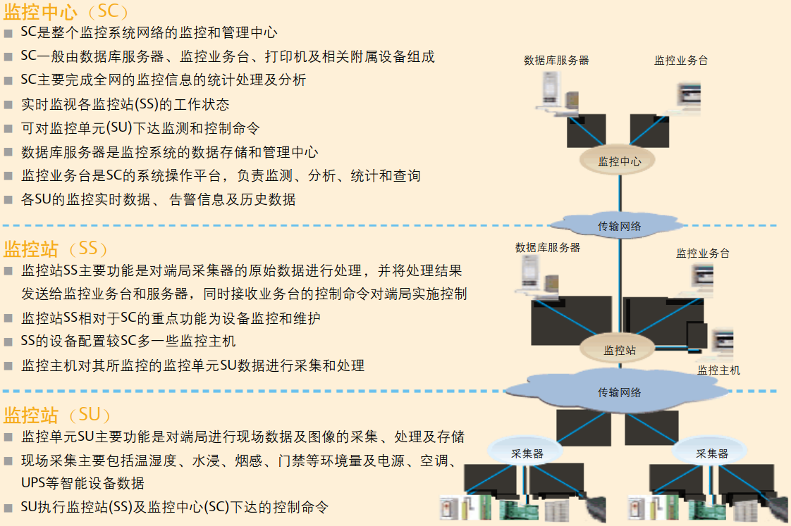

# Power Supply Monitoring System

## 基本结构: 逐级汇接

SC: 监控中心; 市\(地、州\)级; D接口相互连接\(传输`告警协议`\)

SS: 区域监控中心\(监控站\); 县、区级

SU: 监控单元

SM: 监控模块: 数据采集; 分为智能监控模块、附加监控模块

> 非智能设备，需要配合`变送器(数据变换+传送器)`实现其功能

* IP组网。要考虑`广播风暴、资源冲突`
* 2M线路组网
* 环形、链路组网
* 无线组网

## 传输方式

* 串行: Serial
* 并行: Parallel
* 同步: Synchronous
* 异步: Asynchronous

### RS-232

> 串行异步

* speed &lt;= 20 Kbit/s
* 距离 &lt;= 15m
* 全双工

### RS-422

* Tx+、Tx-和Rx+、Rx-，两发两收，传差分信号，抗噪声能力强
* 传输距离比`RS-232`长
* 全双工
* 点到多点

### RS-485

* RS-422的衍生
* 只需两根线，就可传输差分信号，抗噪生能力强
* 点到多点，多点到多点

## 监控对象

* 遥信: 对离散信号进行监控\(如开关信号\)
* 遥测: 对`连续变化的模拟信号`进行监测
* 遥控: 远程发出`离散的控制信号`

> 非智能设备市一般的传感器，可测`温度、湿度、液位、烟雾`等

