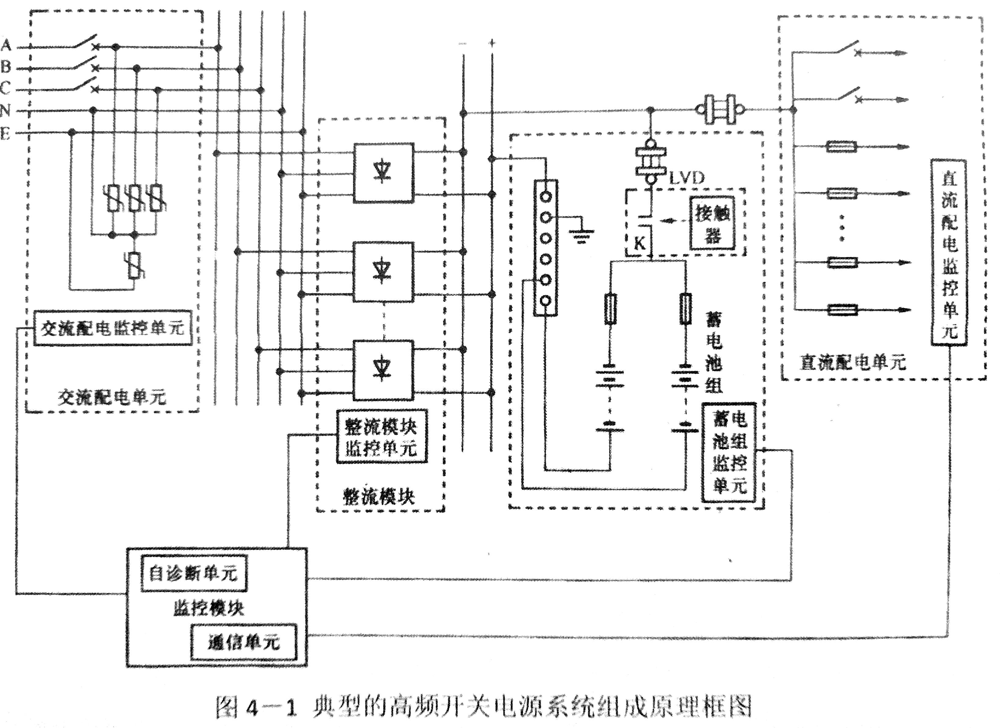
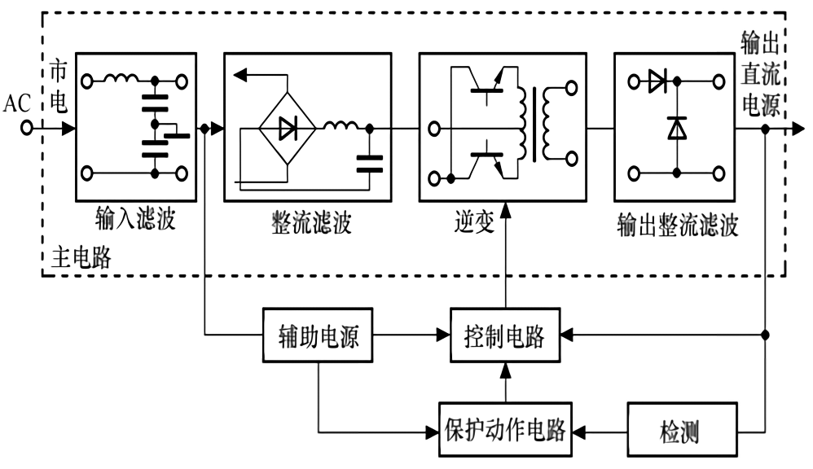
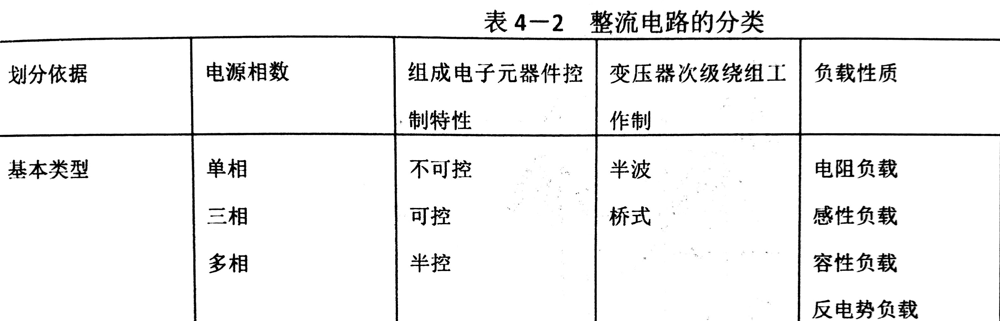
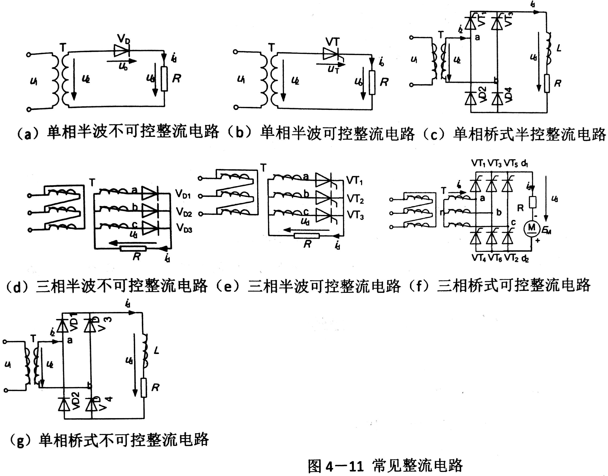
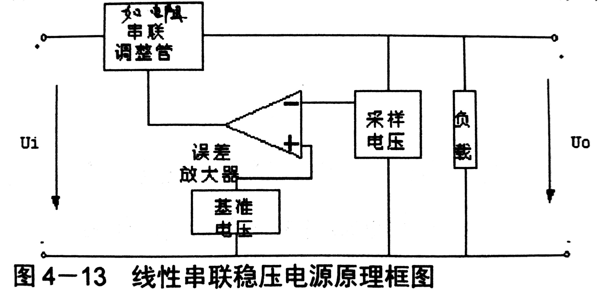
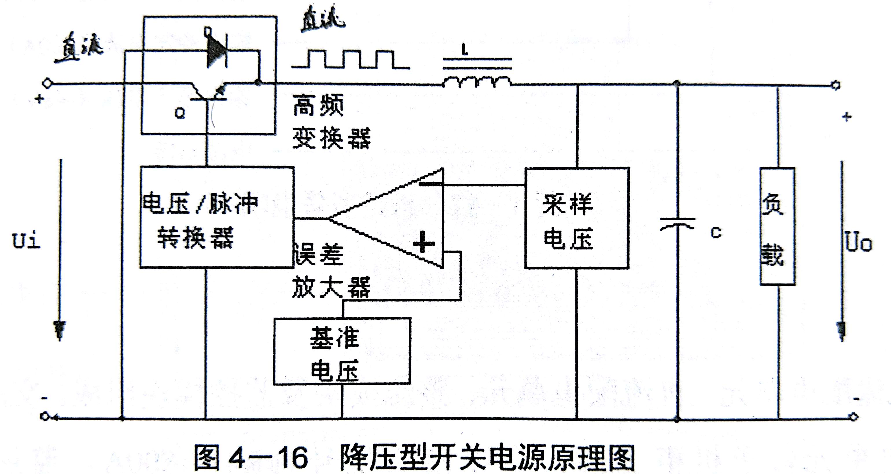

# HF Switched-mode Power Supply

A `switched-mode power supply` is an electronic power supply that incorporates a switching regulator to convert electrical power efficiently. Like other power supplies, an SMPS transfers power from a DC or AC source \(often mains power\) to DC loads.

* 防雷器并联。`雷击产生大电流时`电阻变小，导电到大地。
* 虽然整个系统输入`380V三相电`，`整流模块`却只用了`一相220V`
* 整流模块输出 48V \(但我们想要-48V 给`负载`，所以要将`正极接地`来产生`负电流`\)
* 这个系统的负载需要接到负极，因为正极接了地
* 接触器上的`分流器`在这里被用来`测电压值`。从而可以根据公式推导出`电流值`
* LVD\(Low Voltage Disconnect\): 低压脱离装置，低压时保护电池； 或者可用来 根据设备的重要程度依次断电

## 直流的配电方式

### 低电阻配电: 粗电线，电阻小

优点: 电阻小，线路损耗、压降小

缺点: 某一负载短路后，会使直流瞬间增大，损坏设备

### 高阻配电: 细电线，电阻大

优点: 克服`低阻配电短路 事故`的影响

缺点: 电阻大，线路损耗大

## 直流配电作用

* 测量
* 报警
* 保护

## 高频开关整流器

整流器的作用: `交流`变`直流`

逆变器的作用: `直流`变`交流`

### 主电路

1. 交流输入滤波
2. 整流滤波
3. 功率因数校正
4. 逆变
5. 输出整流滤波

> 为什么这里把`交流到直流`这个过程搞了两次？是为了更加稳定的`直流输出`

### 电子器件

1. 不可控: 比如`二极管`
2. 可控\(全控\): 如`多一个控制输入接口的二极管`
3. 半控: 把上面两个设备搞在一个电路上，如此一来你可以用`多一个控制输入接口的二极管`控制`普通二极管`

### 整流电路的分类

### 稳压原理

因为要保证`输出直流`的超级稳定，所以这里要用`稳压器`

#### 1. 线性稳压

* 优点: 因为有差分放大器，调节灵敏，稳压效果特别好
* 缺点: 三极管\(调整管\)上的损耗功率大，稳压效率低

#### 2. 开关型稳压

* 通过调整`输入电`的“有无比例”，来减少`调整管`的功率损耗
* 电感L在`调整管停工时`放电 \(放电时`正负极`会`反向`\)
* 电容C被用来`滤波`\(过滤`谐波`\)

