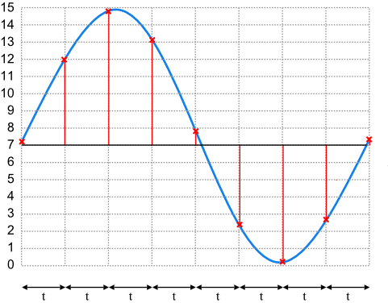
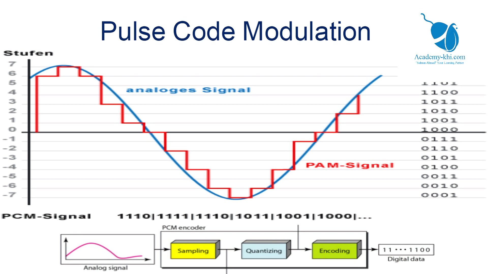

# PCM

Pulse Code Modulation \(PCM\)

> a pulse modulation technique in which the amplitude of an analog signal is converted to a binary value represented as a series of pulses.

## 1. Sampling: get pots in every certain time \(infinite to limited\)



## 2. Quantizing: put every uncertain value into certain value \(standardization\)

## 3. Encoding: convert that value to binary value



## 带通频率选取

```text
def bandpass_sampling(f_low, f_high):
    bandwidth = f_high - f_low
    if bandwidth <= f_low:
        n = int(f_low / bandwidth)
        f_s_min = (2 * f_high) / (n + 1)
        f_s_max = (2 * f_low) / n

        result = 2 * (f_low + f_high) / (2 * n + 1)
        return f_s_min, f_s_max, result
    else:
        print("You should use lowpass-sampling")
        return None

# min, max, result = bandpass_sampling(312, 552)
# print(min, '<=', result, '<=', max)
```

## 13折线法压缩编码

```text
def polyline_compress(max_voltage, target_voltage):
    def to_binary(num, how_many=4):
        r = bin(num)[2:]
        return r + '0' * (how_many - len(r))

    result = ''

    if target_voltage > 0:
        result = '1'
    else:
        result = '0'
    target_voltage = abs(target_voltage)

    parts = list(reversed(list(range(0, 8))))
    after = before = max_voltage
    for part in parts:
        after = after / 2
        if (after < target_voltage < before):
            print(part, ": ", before, '-', after)
            binary_part = to_binary(part, 3)
            delta = (before - after) / 16
            print(delta)
            binary_inner_part = to_binary(int((target_voltage - after) / delta), 4)
            print(int((target_voltage - after) / delta))
            result += binary_part
            result += binary_inner_part
            print(binary_part, binary_inner_part)
            return result
        before = after

# r = polyline_compress(2048, 260)
# print(r)
```

编码时 3位 减一，4位 不变

解码时 3位 加一，4位 不变

