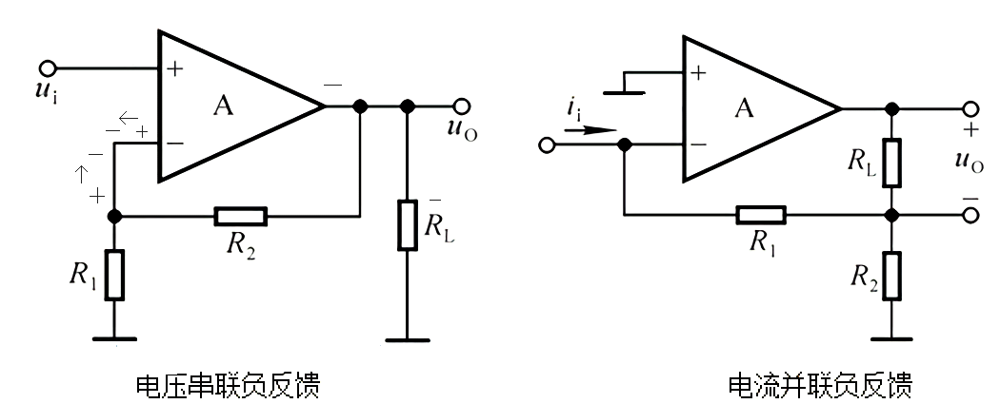

# What's the feedback type

##### 1. 电压 or 电流

`电压反馈`是`把输出电压`再`送到前面`(输入)， 本质特征是：`把输出短路`接地，会`影响反馈`(反馈支路可能会因此变成地线，无电压)

如果`无影响`，则`是电流反馈`
___

##### 2. 并联 or 串联

反馈支路与输入端`b`有节点，并联

反馈支路与输入端`b`无节点，串联

___

##### 3. 负反馈 or 正反馈

研究反馈不能离开反馈支路，你得先找到反馈支路，拿上面的`电压串联负反馈图`举例，反馈支路是$$R_2$$所在线

设反馈支路所在集成放大器的端口输入一个`正信号(+号)`，`A`右边得到`负信号(-)`，最后回到反馈输入端

由图你可以看到两个箭头，你可以明显感觉到它们相互抵消，所以是负反馈

注意：

> 集成运算放大器的正负号是有意义的，`负(-)`代表输入会变号(反向)，`正(+)`代表输入不变号(保持原极性)

> 而对于普通三极管，`eb结`正偏(带箭头)不变号，`cb结`反偏变号

